# Velero Backup & Restore PoC — Kind Cluster on Ubuntu

Velero 是一套開源的 Kubernetes 備份與復原工具，本專案在 Ubuntu x86 本機透過 Kind 叢集完整驗證 Velero 的各項備份、復原與遷移功能。

---

## 目錄

- [Kubernetes 基礎架構](#kubernetes-基礎架構)
- [為什麼需要 K8s 備份](#為什麼需要-k8s-備份)
- [Velero 架構與運作原理](#velero-架構與運作原理)
- [Velero 深入解析](#velero-深入解析)
- [Velero 核心優勢](#velero-核心優勢)
- [MinIO 核心優勢](#minio-核心優勢)
- [Velero + MinIO 組合效益](#velero--minio-組合效益)
- [PoC 架構](#poc-架構)
- [技術元件版本](#技術元件版本)
- [快速開始](#快速開始)
- [PoC 測試案例與結果](#poc-測試案例與結果)
- [備份與復原策略指南](#備份與復原策略指南)
- [常用指令參考](#常用指令參考)
- [常見問題排查](#常見問題排查)
- [企業評估摘要](#企業評估摘要)
- [清理環境](#清理環境)

---

## Kubernetes 基礎架構

如果你是 Kubernetes 初學者，以下是 K8s 的核心架構說明。

### K8s 叢集架構

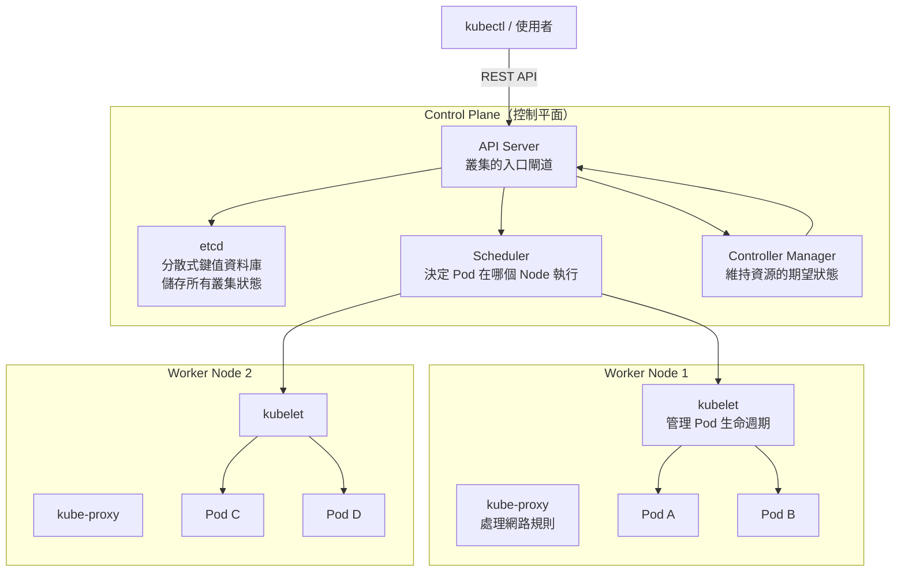
```mermaid
graph TB
    subgraph CP["Control Plane（控制平面）"]
        API["API Server<br/>叢集的入口閘道"]
        ETCD["etcd<br/>分散式鍵值資料庫<br/>儲存所有叢集狀態"]
        SCHED["Scheduler<br/>決定 Pod 在哪個 Node 執行"]
        CM["Controller Manager<br/>維持資源的期望狀態"]
    end

    subgraph W1["Worker Node 1"]
        KL1["kubelet<br/>管理 Pod 生命週期"]
        KP1["kube-proxy<br/>處理網路規則"]
        POD1["Pod A"]
        POD2["Pod B"]
    end

    subgraph W2["Worker Node 2"]
        KL2["kubelet"]
        KP2["kube-proxy"]
        POD3["Pod C"]
        POD4["Pod D"]
    end

    USER["kubectl / 使用者"] -->|REST API| API
    API --> ETCD
    API --> SCHED
    API --> CM
    SCHED --> KL1
    SCHED --> KL2
    CM --> API
    KL1 --> POD1
    KL1 --> POD2
    KL2 --> POD3
    KL2 --> POD4
```

### K8s 核心資源關係

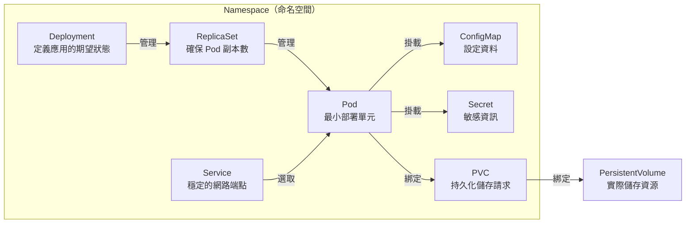
```mermaid
graph LR
    subgraph "Namespace（命名空間）"
        DEP["Deployment<br/>定義應用的期望狀態"]
        RS["ReplicaSet<br/>確保 Pod 副本數"]
        POD["Pod<br/>最小部署單元"]
        SVC["Service<br/>穩定的網路端點"]
        CM["ConfigMap<br/>設定資料"]
        SEC["Secret<br/>敏感資訊"]
        PVC["PVC<br/>持久化儲存請求"]
    end

    PV["PersistentVolume<br/>實際儲存資源"]

    DEP -->|管理| RS
    RS -->|管理| POD
    SVC -->|選取| POD
    POD -->|掛載| CM
    POD -->|掛載| SEC
    POD -->|綁定| PVC
    PVC -->|綁定| PV
```

### K8s 資源分類

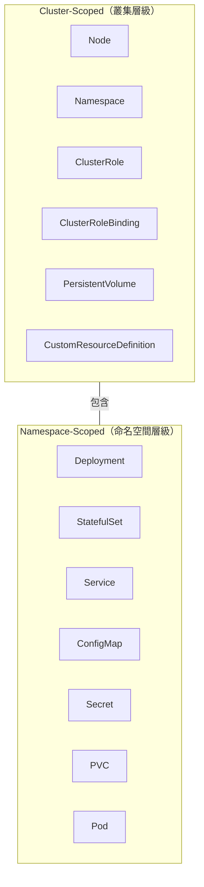
```mermaid
graph TB
    subgraph CL["Cluster-Scoped（叢集層級）"]
        NODE["Node"]
        NS["Namespace"]
        CR["ClusterRole"]
        CRB["ClusterRoleBinding"]
        PV2["PersistentVolume"]
        CRD["CustomResourceDefinition"]
    end

    subgraph NP["Namespace-Scoped（命名空間層級）"]
        DEP2["Deployment"]
        STS["StatefulSet"]
        SVC2["Service"]
        CM2["ConfigMap"]
        SEC2["Secret"]
        PVC2["PVC"]
        POD2["Pod"]
    end

    CL ---|包含| NP
```

> **初學者筆記**：
> - **Pod** 是 K8s 最小部署單元，通常包含一個容器
> - **Deployment** 管理無狀態應用（如 Web Server）
> - **StatefulSet** 管理有狀態應用（如資料庫）
> - **PVC/PV** 提供持久化儲存，Pod 刪除後資料仍保留
> - **Namespace** 用來隔離不同環境或團隊的資源

---

## 為什麼需要 K8s 備份

### K8s 中需要備份的資料

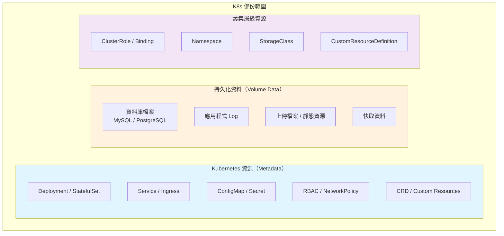
```mermaid
graph TB
    subgraph BACKUP["K8s 備份範圍"]
        subgraph META["Kubernetes 資源（Metadata）"]
            D1["Deployment / StatefulSet"]
            D2["Service / Ingress"]
            D3["ConfigMap / Secret"]
            D4["RBAC / NetworkPolicy"]
            D5["CRD / Custom Resources"]
        end

        subgraph DATA["持久化資料（Volume Data）"]
            V1["資料庫檔案<br/>MySQL / PostgreSQL"]
            V2["應用程式 Log"]
            V3["上傳檔案 / 靜態資源"]
            V4["快取資料"]
        end

        subgraph CLUSTER["叢集層級資源"]
            C1["ClusterRole / Binding"]
            C2["Namespace"]
            C3["StorageClass"]
            C4["CustomResourceDefinition"]
        end
    end

    style META fill:#e1f5fe
    style DATA fill:#fff3e0
    style CLUSTER fill:#f3e5f5
```

### 常見災難場景

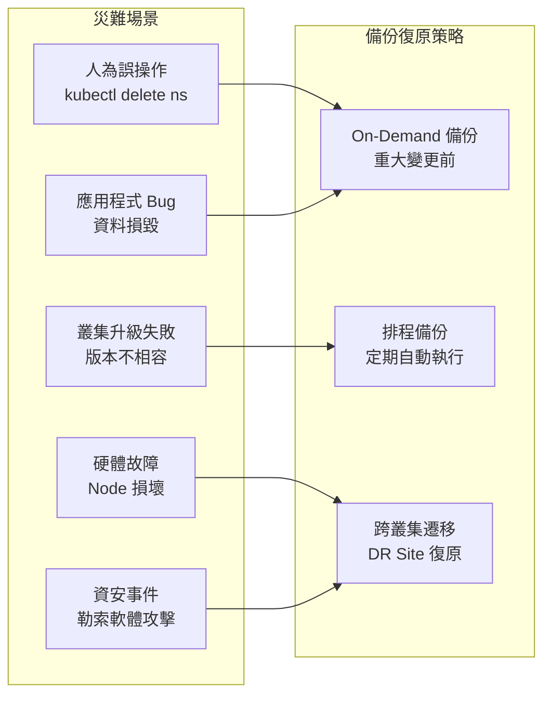
```mermaid
graph LR
    subgraph DISASTERS["災難場景"]
        H1["人為誤操作<br/>kubectl delete ns"]
        H2["應用程式 Bug<br/>資料損毀"]
        H3["叢集升級失敗<br/>版本不相容"]
        H4["硬體故障<br/>Node 損壞"]
        H5["資安事件<br/>勒索軟體攻擊"]
    end

    subgraph SOLUTIONS["備份復原策略"]
        S1["On-Demand 備份<br/>重大變更前"]
        S2["排程備份<br/>定期自動執行"]
        S3["跨叢集遷移<br/>DR Site 復原"]
    end

    H1 --> S1
    H2 --> S1
    H3 --> S2
    H4 --> S3
    H5 --> S3
```

---

## Velero 架構與運作原理

### Velero 元件架構

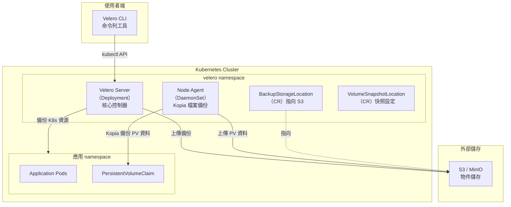
```mermaid
graph TB
    subgraph CLIENT["使用者端"]
        CLI["Velero CLI<br/>命令列工具"]
    end

    subgraph CLUSTER["Kubernetes Cluster"]
        subgraph VNS["velero namespace"]
            VS["Velero Server<br/>（Deployment）<br/>核心控制器"]
            NA["Node Agent<br/>（DaemonSet）<br/>Kopia 檔案備份"]
            BSL["BackupStorageLocation<br/>（CR）指向 S3"]
            VSL["VolumeSnapshotLocation<br/>（CR）快照設定"]
        end

        subgraph APP["應用 namespace"]
            APOD["Application Pods"]
            APVC["PersistentVolumeClaim"]
        end
    end

    subgraph STORAGE["外部儲存"]
        S3["S3 / MinIO<br/>物件儲存"]
    end

    CLI -->|"kubectl API"| VS
    VS -->|"備份 K8s 資源"| APP
    NA -->|"Kopia 備份 PV 資料"| APVC
    VS -->|"上傳備份"| S3
    NA -->|"上傳 PV 資料"| S3
    BSL -.->|"指向"| S3
```

### 備份流程（Backup Workflow）

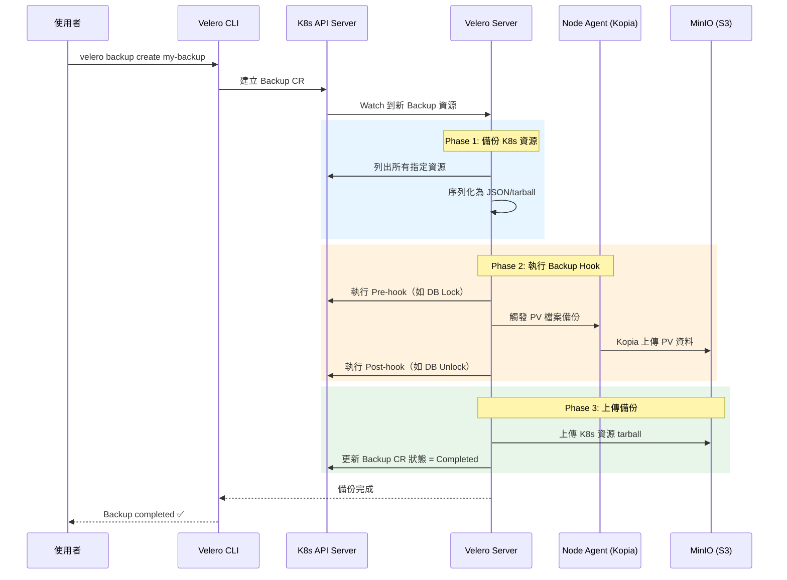
```mermaid
sequenceDiagram
    participant User as 使用者
    participant CLI as Velero CLI
    participant API as K8s API Server
    participant VS as Velero Server
    participant NA as Node Agent (Kopia)
    participant S3 as MinIO (S3)

    User->>CLI: velero backup create my-backup
    CLI->>API: 建立 Backup CR
    API->>VS: Watch 到新 Backup 資源

    rect rgb(230, 245, 255)
        Note over VS: Phase 1: 備份 K8s 資源
        VS->>API: 列出所有指定資源
        VS->>VS: 序列化為 JSON/tarball
    end

    rect rgb(255, 243, 224)
        Note over VS,NA: Phase 2: 執行 Backup Hook
        VS->>API: 執行 Pre-hook（如 DB Lock）
        VS->>NA: 觸發 PV 檔案備份
        NA->>S3: Kopia 上傳 PV 資料
        VS->>API: 執行 Post-hook（如 DB Unlock）
    end

    rect rgb(232, 245, 233)
        Note over VS,S3: Phase 3: 上傳備份
        VS->>S3: 上傳 K8s 資源 tarball
        VS->>API: 更新 Backup CR 狀態 = Completed
    end

    VS-->>CLI: 備份完成
    CLI-->>User: Backup completed ✅
```

### 復原流程（Restore Workflow）

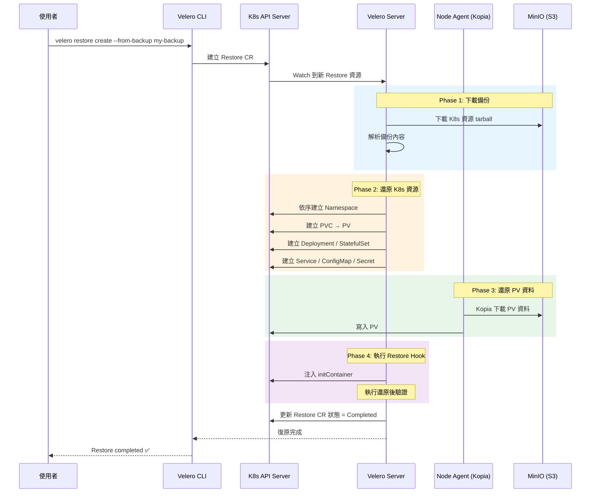
```mermaid
sequenceDiagram
    participant User as 使用者
    participant CLI as Velero CLI
    participant API as K8s API Server
    participant VS as Velero Server
    participant NA as Node Agent (Kopia)
    participant S3 as MinIO (S3)

    User->>CLI: velero restore create --from-backup my-backup
    CLI->>API: 建立 Restore CR
    API->>VS: Watch 到新 Restore 資源

    rect rgb(230, 245, 255)
        Note over VS,S3: Phase 1: 下載備份
        VS->>S3: 下載 K8s 資源 tarball
        VS->>VS: 解析備份內容
    end

    rect rgb(255, 243, 224)
        Note over VS: Phase 2: 還原 K8s 資源
        VS->>API: 依序建立 Namespace
        VS->>API: 建立 PVC → PV
        VS->>API: 建立 Deployment / StatefulSet
        VS->>API: 建立 Service / ConfigMap / Secret
    end

    rect rgb(232, 245, 233)
        Note over NA,S3: Phase 3: 還原 PV 資料
        NA->>S3: Kopia 下載 PV 資料
        NA->>API: 寫入 PV
    end

    rect rgb(243, 229, 245)
        Note over VS: Phase 4: 執行 Restore Hook
        VS->>API: 注入 initContainer
        Note over VS: 執行還原後驗證
    end

    VS->>API: 更新 Restore CR 狀態 = Completed
    VS-->>CLI: 復原完成
    CLI-->>User: Restore completed ✅
```

### Velero 備份層級

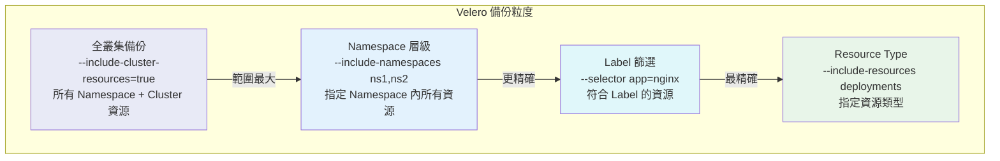
```mermaid
graph TB
    subgraph LEVELS["Velero 備份粒度"]
        L1["全叢集備份<br/>--include-cluster-resources=true<br/>所有 Namespace + Cluster 資源"]
        L2["Namespace 層級<br/>--include-namespaces ns1,ns2<br/>指定 Namespace 內所有資源"]
        L3["Label 篩選<br/>--selector app=nginx<br/>符合 Label 的資源"]
        L4["Resource Type<br/>--include-resources deployments<br/>指定資源類型"]
    end

    L1 -->|範圍最大| L2
    L2 -->|更精確| L3
    L3 -->|最精確| L4

    style L1 fill:#e8eaf6
    style L2 fill:#e3f2fd
    style L3 fill:#e0f7fa
    style L4 fill:#e8f5e9
```

---

## Velero 深入解析

### 歷史與發展

Velero（拉丁語意為「航行」）最初由 Heptio 公司於 2017 年以 **Heptio Ark** 之名開源發布。2019 年 VMware 收購 Heptio 後，專案更名為 Velero 並持續積極維護。2023 年 Broadcom 收購 VMware 後，Velero 仍維持開源社群運作。Velero 採用 Apache 2.0 授權，是目前 Kubernetes 生態系中最廣泛使用的開源備份方案。

**發展里程碑**：

| 時間 | 事件 |
|------|------|
| 2017 | Heptio Ark v0.x 發布，支援基本備份/復原 |
| 2019 | 更名為 Velero，VMware 接手維護 |
| 2020 | v1.4 引入 CSI Snapshot 支援 |
| 2021 | v1.7 改進排程備份與 Hook 機制 |
| 2022 | v1.10 引入 Kopia 作為 Restic 替代方案 |
| 2023 | v1.12 Kopia 成為預設上傳器，強化 Data Mover |
| 2024 | v1.15+ 改進 CSI Snapshot Data Movement |
| 2025 | v1.17 穩定版，本 PoC 使用版本 |

### 核心自訂資源（Custom Resources / CRDs）

Velero 在 Kubernetes 叢集中註冊多個 CRD，透過 Custom Resource 驅動所有操作。每項備份或復原都是一個 CR 物件，可透過 `kubectl` 或 Velero CLI 管理。

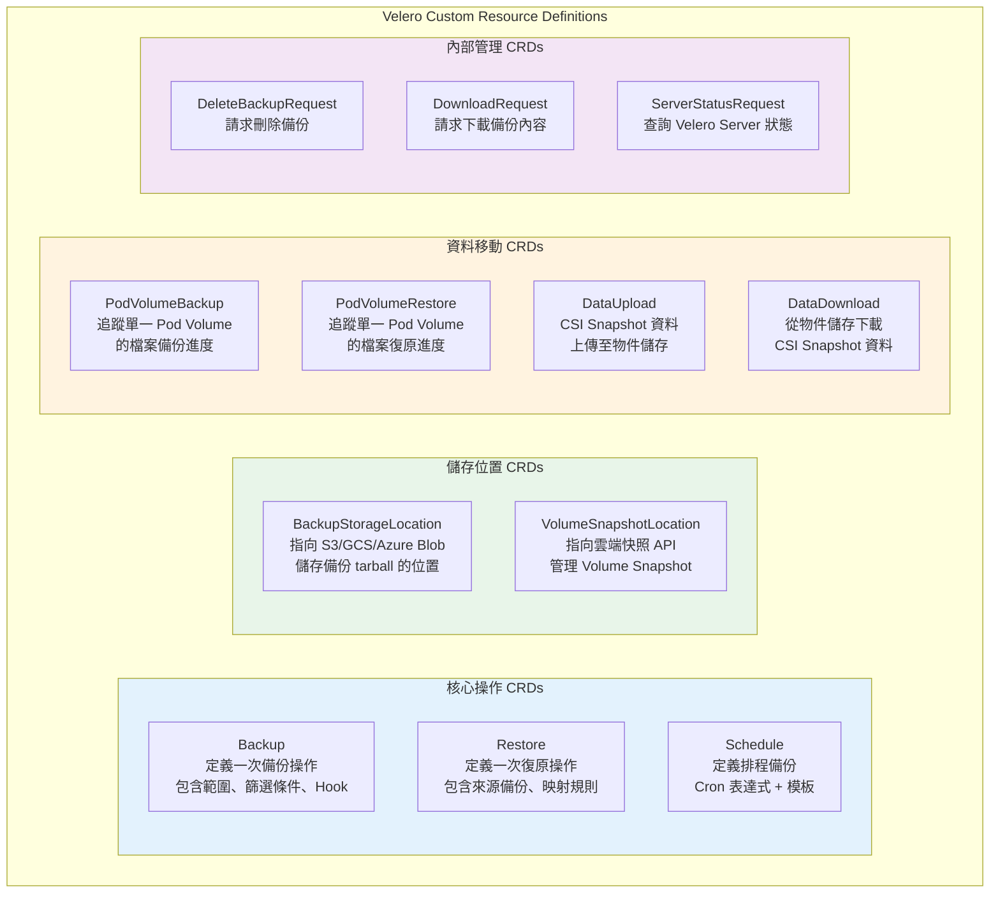
```mermaid
graph TB
    subgraph CRDs["Velero Custom Resource Definitions"]
        subgraph CORE["核心操作 CRDs"]
            BK["Backup<br/>定義一次備份操作<br/>包含範圍、篩選條件、Hook"]
            RS["Restore<br/>定義一次復原操作<br/>包含來源備份、映射規則"]
            SC["Schedule<br/>定義排程備份<br/>Cron 表達式 + 模板"]
        end

        subgraph STORAGE["儲存位置 CRDs"]
            BSL["BackupStorageLocation<br/>指向 S3/GCS/Azure Blob<br/>儲存備份 tarball 的位置"]
            VSL["VolumeSnapshotLocation<br/>指向雲端快照 API<br/>管理 Volume Snapshot"]
        end

        subgraph DATA["資料移動 CRDs"]
            PVB["PodVolumeBackup<br/>追蹤單一 Pod Volume<br/>的檔案備份進度"]
            PVR["PodVolumeRestore<br/>追蹤單一 Pod Volume<br/>的檔案復原進度"]
            DU["DataUpload<br/>CSI Snapshot 資料<br/>上傳至物件儲存"]
            DD["DataDownload<br/>從物件儲存下載<br/>CSI Snapshot 資料"]
        end

        subgraph INTERNAL["內部管理 CRDs"]
            DBC["DeleteBackupRequest<br/>請求刪除備份"]
            DBKP["DownloadRequest<br/>請求下載備份內容"]
            SBR["ServerStatusRequest<br/>查詢 Velero Server 狀態"]
        end
    end

    style CORE fill:#e3f2fd
    style STORAGE fill:#e8f5e9
    style DATA fill:#fff3e0
    style INTERNAL fill:#f3e5f5
```

#### 各 CRD 詳細說明

**Backup CR** — 備份的核心定義

```yaml
apiVersion: velero.io/v1
kind: Backup
metadata:
  name: example-backup
  namespace: velero
spec:
  # 範圍控制
  includedNamespaces: ["demo-app", "demo-db"]   # 包含的 Namespace
  excludedNamespaces: ["kube-system"]            # 排除的 Namespace
  includedResources: ["*"]                       # 包含的資源類型
  excludedResources: ["events"]                  # 排除的資源類型
  includeClusterResources: true                  # 是否包含叢集層級資源
  labelSelector:                                 # Label 篩選
    matchLabels:
      app: nginx

  # Volume 備份
  defaultVolumesToFsBackup: true                 # 預設使用檔案系統備份
  snapshotMoveData: false                        # 是否啟用 CSI Snapshot Data Movement

  # 生命週期
  ttl: 720h0m0s                                  # 備份保留時間（30 天）
  storageLocation: default                       # 使用的 BSL
  volumeSnapshotLocations: ["default"]           # 使用的 VSL

  # Hook
  hooks:
    resources:
      - name: my-hook
        includedNamespaces: ["demo-db"]
        pre: [...]
        post: [...]
status:
  phase: Completed                               # 狀態：New → InProgress → Completed/Failed
  expiration: "2026-03-12T00:00:00Z"
  progress:
    itemsBackedUp: 42
    totalItems: 42
```

**BackupStorageLocation (BSL)** — 備份儲存目的地

```yaml
apiVersion: velero.io/v1
kind: BackupStorageLocation
metadata:
  name: default
  namespace: velero
spec:
  provider: aws                                  # 儲存 Provider（aws/azure/gcp）
  objectStorage:
    bucket: velero-backup                        # S3 Bucket 名稱
    prefix: ""                                   # 物件路徑前綴
  config:
    region: minio                                # S3 Region
    s3ForcePathStyle: "true"                     # MinIO 必須使用 Path Style
    s3Url: http://minio.minio.svc:9000           # S3 端點 URL
  credential:
    name: cloud-credentials                      # 引用的 Secret 名稱
    key: cloud                                   # Secret 中的 Key
  accessMode: ReadWrite                          # ReadWrite 或 ReadOnly
  backupSyncPeriod: 1m                           # 備份同步週期
  validationFrequency: 1m                        # BSL 健康檢查頻率
```

**Schedule CR** — 排程備份定義

```yaml
apiVersion: velero.io/v1
kind: Schedule
metadata:
  name: daily-backup
  namespace: velero
spec:
  schedule: "0 2 * * *"                          # Cron 表達式（每日凌晨 2 點）
  useOwnerReferencesInBackup: false
  template:                                      # 內嵌 Backup Spec
    includedNamespaces: ["demo-app", "demo-db"]
    defaultVolumesToFsBackup: true
    ttl: 168h0m0s                                # 7 天保留
    storageLocation: default
```

### 資料保護機制

Velero 提供三種 Volume 資料保護方式，各有不同的適用場景：

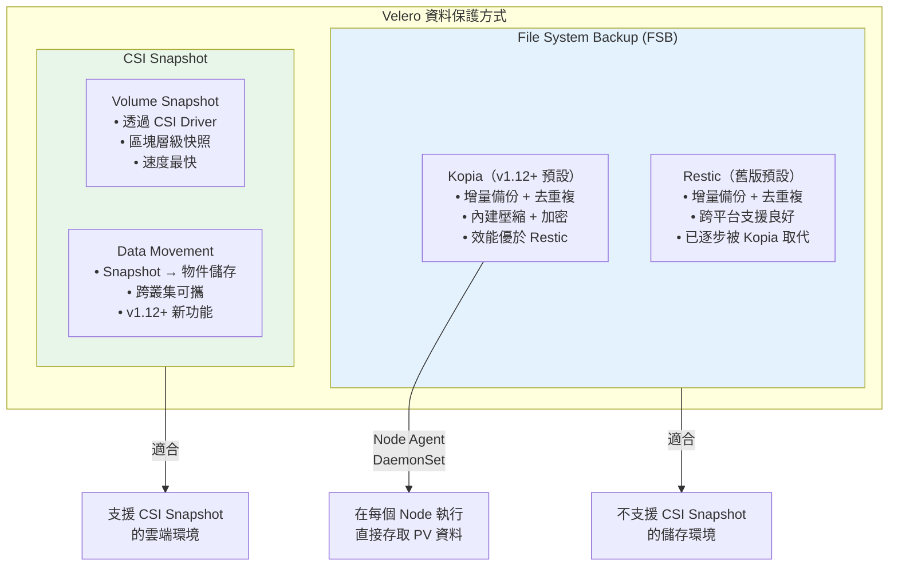
```mermaid
graph TB
    subgraph METHODS["Velero 資料保護方式"]
        subgraph FSB["File System Backup (FSB)"]
            KOPIA["Kopia（v1.12+ 預設）<br/>• 增量備份 + 去重複<br/>• 內建壓縮 + 加密<br/>• 效能優於 Restic"]
            RESTIC["Restic（舊版預設）<br/>• 增量備份 + 去重複<br/>• 跨平台支援良好<br/>• 已逐步被 Kopia 取代"]
        end

        subgraph CSI["CSI Snapshot"]
            SNAP["Volume Snapshot<br/>• 透過 CSI Driver<br/>• 區塊層級快照<br/>• 速度最快"]
            DM["Data Movement<br/>• Snapshot → 物件儲存<br/>• 跨叢集可攜<br/>• v1.12+ 新功能"]
        end
    end

    FSB -->|"適合"| USE1["不支援 CSI Snapshot<br/>的儲存環境"]
    CSI -->|"適合"| USE2["支援 CSI Snapshot<br/>的雲端環境"]
    KOPIA -->|"Node Agent<br/>DaemonSet"| AGENT["在每個 Node 執行<br/>直接存取 PV 資料"]

    style FSB fill:#e3f2fd
    style CSI fill:#e8f5e9
```

#### Kopia vs Restic 比較

| 特性 | Kopia（推薦） | Restic |
|------|--------------|--------|
| 增量備份 | 區塊層級 dedup | 區塊層級 dedup |
| 壓縮 | 支援（zstd, s2 等） | 不支援 |
| 加密 | 內建 AES-256-GCM | 內建 AES-256 |
| 並行處理 | 多執行緒上傳/下載 | 單執行緒 |
| 效能 | 較快（2-5x） | 較慢 |
| 記憶體使用 | 較低 | 較高 |
| Velero 狀態 | v1.12+ 預設推薦 | 維護模式 |

#### 檔案系統備份運作流程

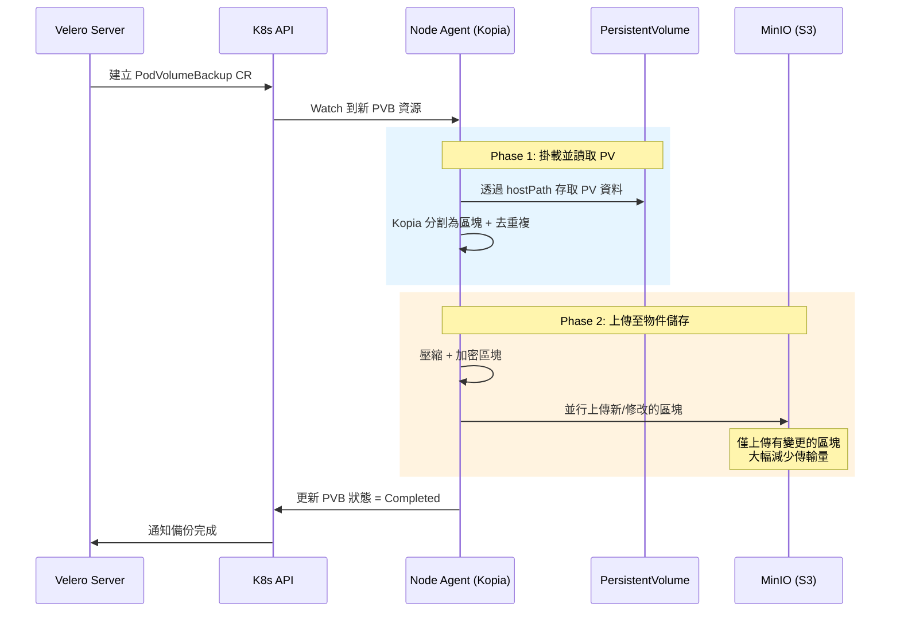
```mermaid
sequenceDiagram
    participant VS as Velero Server
    participant API as K8s API
    participant NA as Node Agent (Kopia)
    participant PV as PersistentVolume
    participant S3 as MinIO (S3)

    VS->>API: 建立 PodVolumeBackup CR
    API->>NA: Watch 到新 PVB 資源

    rect rgb(230, 245, 255)
        Note over NA,PV: Phase 1: 掛載並讀取 PV
        NA->>PV: 透過 hostPath 存取 PV 資料
        NA->>NA: Kopia 分割為區塊 + 去重複
    end

    rect rgb(255, 243, 224)
        Note over NA,S3: Phase 2: 上傳至物件儲存
        NA->>NA: 壓縮 + 加密區塊
        NA->>S3: 並行上傳新/修改的區塊
        Note over S3: 僅上傳有變更的區塊<br/>大幅減少傳輸量
    end

    NA->>API: 更新 PVB 狀態 = Completed
    API->>VS: 通知備份完成
```

### Plugin 架構

Velero 採用 Go Plugin 機制，透過 gRPC 介面與插件溝通。每個 Plugin 以 sidecar 容器的形式執行在 Velero Deployment 中。

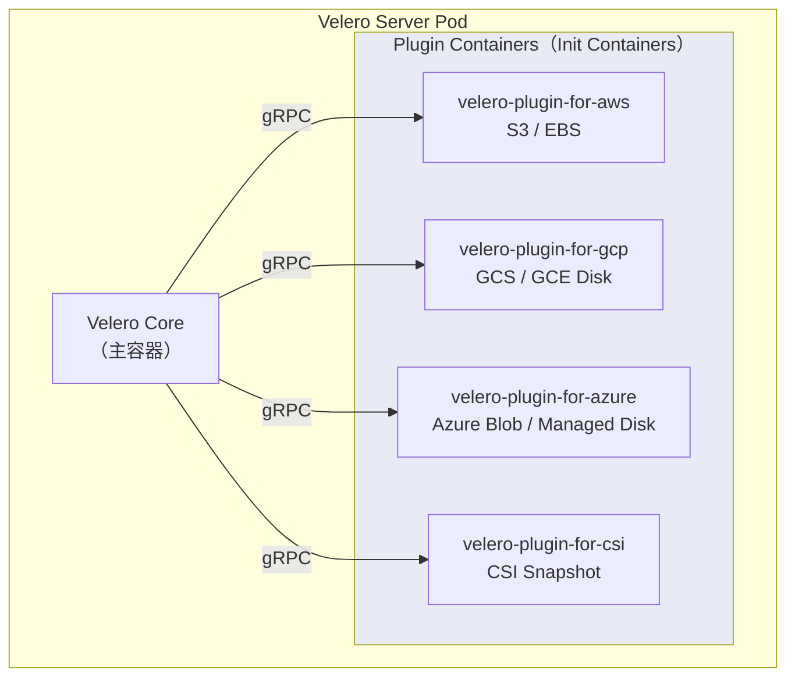
```mermaid
graph TB
    subgraph VELERO["Velero Server Pod"]
        CORE2["Velero Core<br/>（主容器）"]
        subgraph PLUGINS["Plugin Containers（Init Containers）"]
            P1["velero-plugin-for-aws<br/>S3 / EBS"]
            P2["velero-plugin-for-gcp<br/>GCS / GCE Disk"]
            P3["velero-plugin-for-azure<br/>Azure Blob / Managed Disk"]
            P4["velero-plugin-for-csi<br/>CSI Snapshot"]
        end
    end

    CORE2 -->|"gRPC"| P1
    CORE2 -->|"gRPC"| P2
    CORE2 -->|"gRPC"| P3
    CORE2 -->|"gRPC"| P4

    style PLUGINS fill:#e8eaf6
```

#### Plugin 類型

| Plugin 介面 | 用途 | 範例 |
|-------------|------|------|
| **ObjectStore** | 讀寫物件儲存 | AWS S3, GCS, Azure Blob, MinIO |
| **VolumeSnapshotter** | 管理 Volume 快照 | AWS EBS, GCE PD, Azure Disk |
| **BackupItemAction** | 備份時對個別資源執行自訂動作 | 修改 Resource YAML, 觸發快照 |
| **RestoreItemAction** | 復原時對個別資源執行自訂動作 | 修改還原的 YAML, 重設 Service IP |
| **DeleteItemAction** | 刪除備份時執行自訂清理 | 刪除雲端快照 |

> **本 PoC 使用**：`velero-plugin-for-aws:v1.11.0` — 透過 ObjectStore 介面與 MinIO S3 API 互通。

### 資源篩選機制詳解

Velero 提供多層篩選機制，可精確控制備份與復原的範圍：

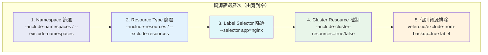
```mermaid
graph TB
    subgraph FILTER["資源篩選層次（由寬到窄）"]
        F1["1. Namespace 篩選<br/>--include-namespaces / --exclude-namespaces"]
        F2["2. Resource Type 篩選<br/>--include-resources / --exclude-resources"]
        F3["3. Label Selector 篩選<br/>--selector app=nginx"]
        F4["4. Cluster Resource 控制<br/>--include-cluster-resources=true/false"]
        F5["5. 個別資源排除<br/>velero.io/exclude-from-backup=true label"]
    end

    F1 --> F2 --> F3 --> F4 --> F5

    style F1 fill:#e8eaf6
    style F2 fill:#e3f2fd
    style F3 fill:#e0f7fa
    style F4 fill:#e8f5e9
    style F5 fill:#fff3e0
```

#### 個別資源排除

在特定資源上加上 label 即可將其排除在備份之外：

```yaml
apiVersion: v1
kind: ConfigMap
metadata:
  name: temporary-config
  labels:
    velero.io/exclude-from-backup: "true"   # Velero 會自動跳過此資源
```

#### 復原時的篩選

復原時可進一步篩選要還原的資源子集：

```bash
velero restore create my-restore \
  --from-backup full-backup-01 \
  --include-namespaces demo-app \           # 僅還原 demo-app namespace
  --include-resources configmaps,secrets \  # 僅還原 ConfigMap 與 Secret
  --selector tier=frontend \                # 僅還原符合 label 的資源
  --namespace-mappings demo-app:demo-app-v2 # 還原到不同 Namespace
```

### Hook 機制詳解

Hook 是 Velero 實現應用程式一致性備份的關鍵機制。透過在備份/復原的特定時間點執行自訂指令，確保資料狀態的一致性。

#### Backup Hook（備份掛鉤）

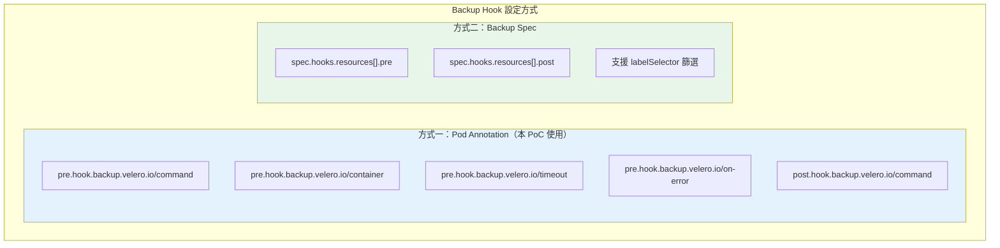
```mermaid
graph TB
    subgraph BHOOK["Backup Hook 設定方式"]
        subgraph ANNO["方式一：Pod Annotation（本 PoC 使用）"]
            A1["pre.hook.backup.velero.io/command"]
            A2["pre.hook.backup.velero.io/container"]
            A3["pre.hook.backup.velero.io/timeout"]
            A4["pre.hook.backup.velero.io/on-error"]
            A5["post.hook.backup.velero.io/command"]
        end

        subgraph SPEC["方式二：Backup Spec"]
            S1["spec.hooks.resources[].pre"]
            S2["spec.hooks.resources[].post"]
            S3["支援 labelSelector 篩選"]
        end
    end

    style ANNO fill:#e3f2fd
    style SPEC fill:#e8f5e9
```

**方式一：Pod Annotation（推薦用於持續性設定）**

```yaml
# 直接在 Pod Template 中設定，每次備份自動生效
metadata:
  annotations:
    # Pre-backup：備份前執行（例如鎖定資料庫）
    pre.hook.backup.velero.io/command: '["/bin/bash", "-c", "mysqldump ..."]'
    pre.hook.backup.velero.io/container: mysql       # 指定容器（可選）
    pre.hook.backup.velero.io/timeout: "30s"          # 逾時時間
    pre.hook.backup.velero.io/on-error: Fail          # Fail 或 Continue

    # Post-backup：備份後執行（例如解鎖資料庫）
    post.hook.backup.velero.io/command: '["/bin/bash", "-c", "UNLOCK TABLES"]'
    post.hook.backup.velero.io/timeout: "10s"
```

**方式二：Backup Spec（推薦用於一次性設定）**

```yaml
apiVersion: velero.io/v1
kind: Backup
spec:
  hooks:
    resources:
      - name: mysql-lock
        includedNamespaces: ["demo-db"]
        labelSelector:
          matchLabels:
            app: mysql
        pre:
          - exec:
              command: ["/bin/bash", "-c", "FLUSH TABLES WITH READ LOCK"]
              timeout: 30s
              onError: Fail
        post:
          - exec:
              command: ["/bin/bash", "-c", "UNLOCK TABLES"]
              timeout: 10s
```

#### Restore Hook（復原掛鉤）

Restore Hook 透過注入 `initContainer` 的方式，在 Pod 啟動前執行復原後驗證或初始化。

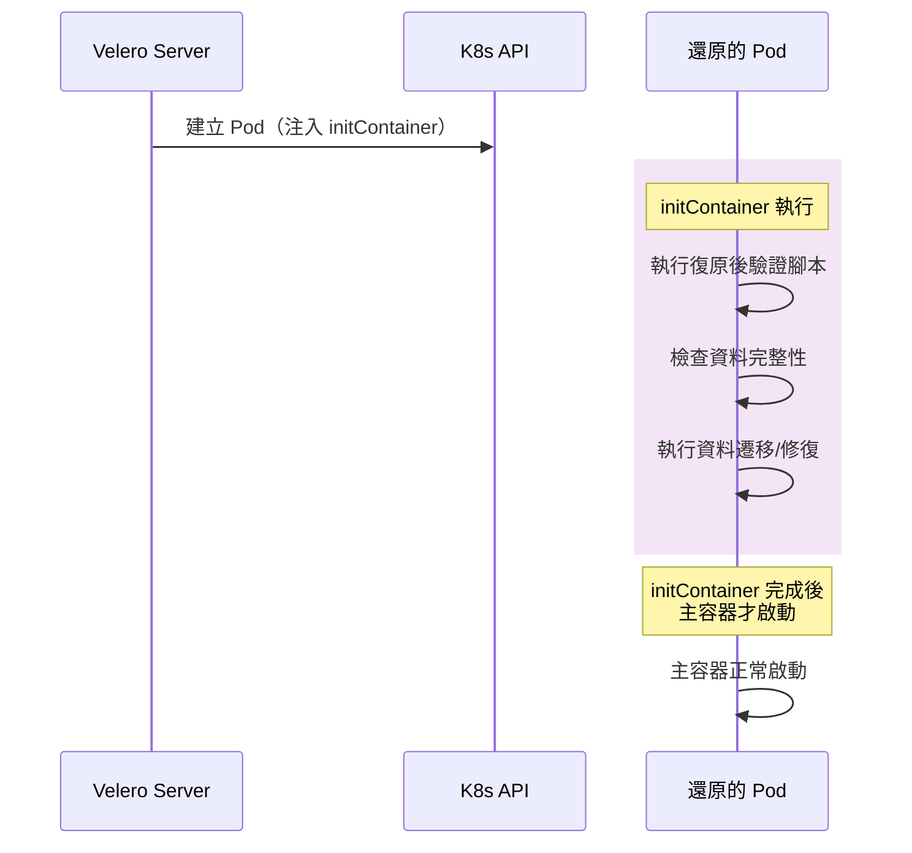
```mermaid
sequenceDiagram
    participant VS as Velero Server
    participant API as K8s API
    participant Pod as 還原的 Pod

    VS->>API: 建立 Pod（注入 initContainer）

    rect rgb(243, 229, 245)
        Note over Pod: initContainer 執行
        Pod->>Pod: 執行復原後驗證腳本
        Pod->>Pod: 檢查資料完整性
        Pod->>Pod: 執行資料遷移/修復
    end

    Note over Pod: initContainer 完成後<br/>主容器才啟動
    Pod->>Pod: 主容器正常啟動
```

#### 常見 Hook 應用場景

| 資料庫 | Pre-backup Hook | Post-backup Hook |
|--------|----------------|-----------------|
| **MySQL** | `FLUSH TABLES WITH READ LOCK` | `UNLOCK TABLES` |
| **PostgreSQL** | `pg_start_backup('velero')` | `pg_stop_backup()` |
| **MongoDB** | `db.fsyncLock()` | `db.fsyncUnlock()` |
| **Redis** | `BGSAVE` | — |
| **Elasticsearch** | `_flush/synced` | — |

### 安全性與加密

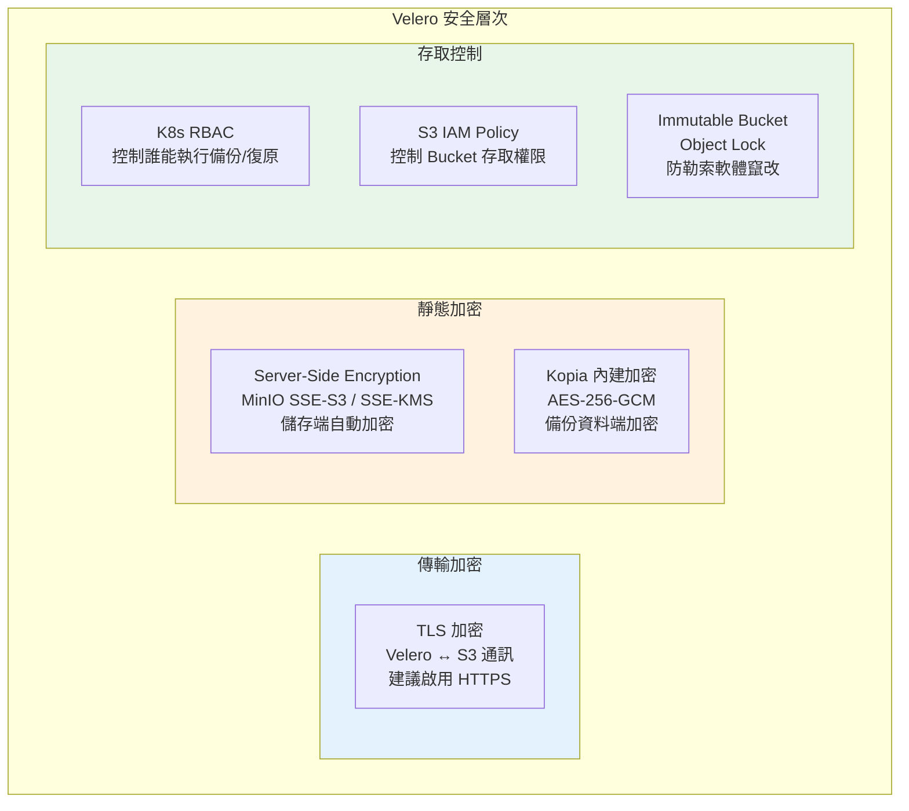
```mermaid
graph TB
    subgraph SECURITY["Velero 安全層次"]
        subgraph TRANSIT["傳輸加密"]
            TLS["TLS 加密<br/>Velero ↔ S3 通訊<br/>建議啟用 HTTPS"]
        end

        subgraph REST["靜態加密"]
            SSE["Server-Side Encryption<br/>MinIO SSE-S3 / SSE-KMS<br/>儲存端自動加密"]
            KENC["Kopia 內建加密<br/>AES-256-GCM<br/>備份資料端加密"]
        end

        subgraph ACCESS["存取控制"]
            RBAC2["K8s RBAC<br/>控制誰能執行備份/復原"]
            IAM["S3 IAM Policy<br/>控制 Bucket 存取權限"]
            IMMUT["Immutable Bucket<br/>Object Lock<br/>防勒索軟體竄改"]
        end
    end

    style TRANSIT fill:#e3f2fd
    style REST fill:#fff3e0
    style ACCESS fill:#e8f5e9
```

---

## Velero 核心優勢

### 對比傳統備份方案

| 面向 | 傳統 VM 備份 | etcd Snapshot | **Velero** |
|------|-------------|---------------|-----------|
| 備份粒度 | 整台 VM | 整個 etcd | Namespace / Label / Resource Type |
| 選擇性復原 | 不支援 | 不支援 | 支援任意組合 |
| 跨叢集遷移 | 困難 | 困難 | 原生支援 |
| 應用一致性 | 無 | 無 | Hook 機制 |
| Volume 資料 | 仰賴快照 | 不備份 | FSB + CSI Snapshot |
| 排程備份 | 需外部工具 | 需外部工具 | 內建 Schedule CRD |
| 成本 | 商業授權 | 免費但功能有限 | 免費開源（Apache 2.0） |

### 十大核心優勢

**1. 完全開源且無授權限制**
- Apache 2.0 授權，可自由用於商業環境
- 無節點數量限制、無備份容量限制
- 社群活躍，GitHub 8000+ Stars，持續迭代更新

**2. Kubernetes 原生設計**
- 所有操作透過 CRD 驅動，完全融入 K8s 生態
- 可透過 `kubectl` 管理所有備份資源
- 支援 GitOps 工作流程（Backup/Schedule 可納入版本控制）

**3. 精細化備份粒度**
- 支援全叢集、Namespace、Label、Resource Type 多種粒度
- 可精確排除不需要的資源，減少備份大小與時間
- 支援叢集層級資源（ClusterRole、CRD 等）備份

**4. 高效的增量備份**
- Kopia 引擎支援區塊層級去重複（Deduplication）
- 僅上傳變更的資料區塊，大幅減少網路傳輸與儲存空間
- 內建壓縮進一步降低儲存成本

**5. 應用程式一致性保證**
- Pre/Post Backup Hook 確保資料庫等有狀態應用的一致性
- 支援 Pod Annotation 和 Backup Spec 兩種 Hook 設定方式
- 可配置 Hook 失敗時的行為（Fail 或 Continue）

**6. 靈活的復原選項**
- 支援完整復原、選擇性復原、跨 Namespace 復原
- Namespace Mapping 實現跨叢集遷移
- `--existing-resource-policy=update` 支援就地更新
- Restore Hook 支援復原後自動驗證

**7. 多雲端與混合雲支援**
- 官方 Plugin 支援 AWS、Azure、GCP
- S3 相容協定支援 MinIO、Ceph、NetApp StorageGRID 等
- 可在不同雲端之間遷移工作負載

**8. 自動化生命週期管理**
- 內建 Schedule CRD 支援 Cron 排程
- TTL 機制自動清理過期備份，避免儲存空間膨脹
- Garbage Collection 自動回收孤立資源

**9. 可擴展的 Plugin 架構**
- gRPC 介面允許開發自訂 Plugin
- BackupItemAction / RestoreItemAction 可對特定資源做自訂處理
- 社群提供豐富的第三方 Plugin

**10. 企業級災難復原能力**
- 支援多個 BackupStorageLocation 實現 3-2-1 策略
- ReadOnly BSL 防止備份被意外修改
- 跨地域複寫確保區域性災難的復原能力

---

## MinIO 核心優勢

### MinIO 簡介

MinIO 是一套高效能、S3 API 相容的開源物件儲存系統。它可以部署在任何基礎架構上（裸機、VM、Kubernetes、邊緣節點），是 Velero 在非公有雲環境中最理想的備份目的地。

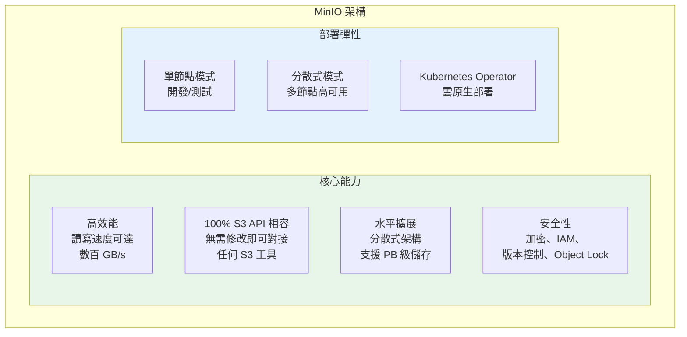
```mermaid
graph TB
    subgraph MINIO_ARCH["MinIO 架構"]
        subgraph FEATURES["核心能力"]
            PERF["高效能<br/>讀寫速度可達<br/>數百 GB/s"]
            S3API["100% S3 API 相容<br/>無需修改即可對接<br/>任何 S3 工具"]
            SCALE["水平擴展<br/>分散式架構<br/>支援 PB 級儲存"]
            SEC3["安全性<br/>加密、IAM、<br/>版本控制、Object Lock"]
        end

        subgraph DEPLOY["部署彈性"]
            SINGLE["單節點模式<br/>開發/測試"]
            DIST["分散式模式<br/>多節點高可用"]
            K8SMODE["Kubernetes Operator<br/>雲原生部署"]
        end
    end

    style FEATURES fill:#e8f5e9
    style DEPLOY fill:#e3f2fd
```

### 十大核心優勢

**1. 完整的 S3 API 相容性**
- 100% 相容 AWS S3 API，包括 Multipart Upload、Versioning、Lifecycle Policy
- 任何支援 S3 的工具（Velero、Terraform、Spark 等）皆可直接使用
- 從 AWS S3 遷移到 MinIO 無需修改應用程式碼

**2. 卓越的效能表現**
- 在標準硬體上可達到 325 GiB/s 讀取、165 GiB/s 寫入
- 專為大量小檔案與大檔案混合工作負載最佳化
- 低延遲設計，適合即時備份場景

**3. 開源且商業友善**
- GNU AGPL v3 開源授權，社群版完全免費
- 提供商業訂閱（含技術支援與進階功能）
- 無隱藏費用，無資料傳輸費

**4. 資料保護與冗餘**
- Erasure Coding（糾刪碼）確保即使部分磁碟故障仍可讀取資料
- Bitrot Protection 自動偵測並修復靜默資料損毀
- 可配置的冗餘等級（EC:2 到 EC:8）

**5. 企業級安全性**
- Server-Side Encryption（SSE-S3 / SSE-KMS）靜態加密
- 支援外部 KMS（HashiCorp Vault, AWS KMS, GCP KMS）
- TLS 加密傳輸、IAM Policy 精細存取控制

**6. 不可變備份（Immutability）**
- Object Lock + WORM 模式防止備份被刪除或修改
- 法規遵循模式（Compliance Mode）滿足金融/醫療法規要求
- 有效防禦勒索軟體攻擊

**7. 版本控制與生命週期管理**
- Bucket Versioning 保留所有物件的歷史版本
- Lifecycle Policy 自動刪除過期物件，控制儲存成本
- 與 Velero TTL 機制搭配實現雙重過期管理

**8. 原生 Kubernetes 整合**
- 官方提供 MinIO Operator 與 Helm Chart
- 支援 CSI Driver 作為 PV 後端
- 輕量部署，單一 Pod 即可運作（如本 PoC）

**9. 多站點複寫**
- Bucket Replication 實現跨站點資料同步
- 支援單向（Active-Passive）與雙向（Active-Active）複寫
- 搭配 Velero Multi-BSL 建構完整的異地備援

**10. 豐富的監控與管理**
- 內建 Web Console（本 PoC 透過 port 9001 存取）
- Prometheus Metrics 端點，可整合 Grafana 監控
- 支援 Audit Log 與 Event Notification（Webhook, Kafka, AMQP）

---

## Velero + MinIO 組合效益

### 為什麼 Velero 與 MinIO 是最佳搭檔

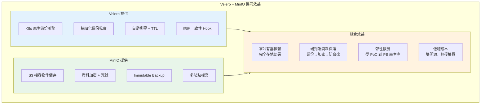
```mermaid
graph TB
    subgraph SYNERGY["Velero + MinIO 協同效益"]
        subgraph V_SIDE["Velero 提供"]
            V1["K8s 原生備份引擎"]
            V2["精細化備份粒度"]
            V3["自動排程 + TTL"]
            V4["應用一致性 Hook"]
        end

        subgraph M_SIDE["MinIO 提供"]
            M1["S3 相容物件儲存"]
            M2["資料加密 + 冗餘"]
            M3["Immutable Backup"]
            M4["多站點複寫"]
        end

        subgraph RESULT["組合效益"]
            R1["零公有雲依賴<br/>完全在地部署"]
            R2["端到端資料保護<br/>備份→加密→防竄改"]
            R3["彈性擴展<br/>從 PoC 到 PB 級生產"]
            R4["低總成本<br/>雙開源、無授權費"]
        end
    end

    V_SIDE --> RESULT
    M_SIDE --> RESULT

    style V_SIDE fill:#e3f2fd
    style M_SIDE fill:#e8f5e9
    style RESULT fill:#fff3e0
```

### 組合優勢總結

| 效益 | 說明 |
|------|------|
| **資料主權** | 所有備份資料儲存在組織自有基礎架構，不經過公有雲 |
| **零 Egress 費用** | 不需支付雲端資料傳輸費，備份頻率不影響成本 |
| **合規就緒** | MinIO Object Lock + Velero 排程 = 滿足資料保留法規 |
| **災難復原** | MinIO 多站點複寫 + Velero Multi-BSL = 異地備援 |
| **效能可控** | 備份目的地在本地網路，傳輸速度可預期 |
| **從 PoC 到生產** | 同一套架構，只需擴展 MinIO 節點數即可應對生產規模 |
| **技術支援** | 兩者皆有活躍社群與商業支援選項 |

### 適用場景

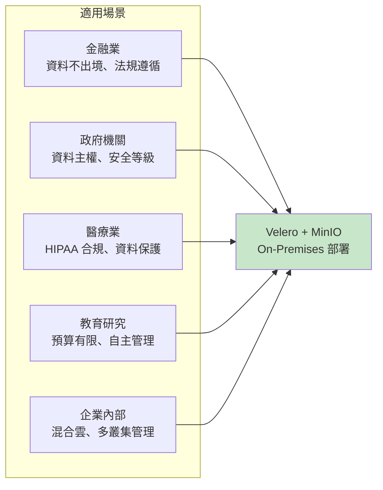
```mermaid
graph LR
    subgraph SCENARIOS["適用場景"]
        S1["金融業<br/>資料不出境、法規遵循"]
        S2["政府機關<br/>資料主權、安全等級"]
        S3["醫療業<br/>HIPAA 合規、資料保護"]
        S4["教育研究<br/>預算有限、自主管理"]
        S5["企業內部<br/>混合雲、多叢集管理"]
    end

    S1 --> SOL["Velero + MinIO<br/>On-Premises 部署"]
    S2 --> SOL
    S3 --> SOL
    S4 --> SOL
    S5 --> SOL

    style SOL fill:#c8e6c9
```

---

## PoC 架構

```mermaid
graph TB
    subgraph HOST["Ubuntu x86 Host"]
        subgraph KIND["Kind Cluster — k8s v1.31"]
            subgraph VEL["velero namespace"]
                VSRV["Velero Server"]
                NAGENT["Node Agent<br/>（Kopia）"]
                AWSP["AWS Plugin"]
            end

            subgraph APP["demo-app namespace"]
                NGX["Nginx Deployment<br/>× 2 replicas"]
                NPVC["PVC: nginx-logs<br/>1Gi"]
                ACFG["ConfigMap: app-config"]
                ASEC["Secret: app-secret"]
            end

            subgraph DB["demo-db namespace"]
                MYSQL["MySQL StatefulSet<br/>含 Backup Hook"]
                MPVC["PVC: mysql-data<br/>2Gi"]
            end

            subgraph MINIO["minio namespace"]
                MS3["MinIO Server<br/>S3 API :9000"]
                MCO["MinIO Console<br/>:9001"]
            end
        end
    end

    VSRV -->|"備份 K8s 資源"| APP
    VSRV -->|"備份 K8s 資源"| DB
    NAGENT -->|"Kopia 備份"| NPVC
    NAGENT -->|"Kopia 備份"| MPVC
    VSRV -->|"S3 協定"| MS3

    style VEL fill:#e8eaf6
    style APP fill:#e3f2fd
    style DB fill:#fff3e0
    style MINIO fill:#e8f5e9
```

## 技術元件版本

| 元件 | 版本 | 用途 |
|------|------|------|
| Velero | v1.17.0 | K8s 備份復原核心 |
| Velero AWS Plugin | v1.11.0 | S3 相容儲存介面 |
| Kind | v0.24.0 | 本機 K8s 叢集 |
| Kubernetes | v1.31.0 | 容器編排平台 |
| MinIO | latest | S3 相容物件儲存 |
| Kopia | (內建) | 檔案系統層級備份引擎 |
| MySQL | 8.0 | 有狀態示範應用（含 Hook） |
| Nginx | 1.27 | 無狀態示範應用（含 PVC） |

---

## 快速開始

### 前置需求

| 項目 | 最低需求 | 建議配置 |
|------|---------|---------|
| OS | Ubuntu 22.04+ x86_64 | Ubuntu 24.04 LTS |
| CPU | 4 cores | 8 cores |
| RAM | 8 GB | 16 GB |
| Disk | 40 GB | 80 GB SSD |
| Docker | 24.0+ | 27.x |
| kubectl | 1.28+ | 1.30+ |
| Helm | 3.12+ | 3.16+ |

### Step 1 — 安裝工具

```bash
# 安裝 Kind v0.24.0
curl -Lo ./kind https://kind.sigs.k8s.io/dl/v0.24.0/kind-linux-amd64
chmod +x ./kind && sudo mv ./kind /usr/local/bin/

# 安裝 Velero CLI v1.17.0
VELERO_VERSION=v1.17.0
curl -L https://github.com/vmware-tanzu/velero/releases/download/${VELERO_VERSION}/velero-${VELERO_VERSION}-linux-amd64.tar.gz -o velero.tar.gz
tar -xzf velero.tar.gz
sudo mv velero-${VELERO_VERSION}-linux-amd64/velero /usr/local/bin/
rm -rf velero.tar.gz velero-${VELERO_VERSION}-linux-amd64

# 安裝 MinIO Client
curl -LO https://dl.min.io/client/mc/release/linux-amd64/mc
chmod +x mc && sudo mv mc /usr/local/bin/
```

### Step 2 — 建立 Kind 叢集

```bash
kind create cluster --config kind-config.yaml --wait 300s
kubectl cluster-info --context kind-velero-poc
kubectl get nodes
```

### Step 3 — 部署 MinIO

```bash
kubectl apply -f minio-deployment.yaml
kubectl wait --for=condition=ready pod -l app=minio -n minio --timeout=120s

# 建立 Bucket
kubectl port-forward svc/minio -n minio 9000:9000 &
sleep 3
mc alias set myminio http://localhost:9000 minioadmin minioadmin123
mc mb myminio/velero-backup
mc mb myminio/velero-backup-secondary
kill %1
```

### Step 4 — 安裝 Velero

```bash
# 建立憑證檔
cat <<EOF > credentials-velero
[default]
aws_access_key_id=minioadmin
aws_secret_access_key=minioadmin123
EOF

# 安裝 Velero
velero install \
  --provider aws \
  --plugins velero/velero-plugin-for-aws:v1.11.0 \
  --bucket velero-backup \
  --secret-file ./credentials-velero \
  --backup-location-config \
    region=minio,s3ForcePathStyle="true",s3Url=http://minio.minio.svc:9000 \
  --snapshot-location-config region=minio \
  --use-node-agent \
  --uploader-type=kopia \
  --wait

# 驗證安裝
kubectl get pods -n velero
velero backup-location get
# 預期：Phase = Available
```

### Step 5 — 部署示範應用程式

```bash
kubectl apply -f demo-nginx.yaml
kubectl apply -f demo-mysql.yaml

# 等待所有 Pod 就緒
kubectl wait --for=condition=ready pod -l app=nginx -n demo-app --timeout=120s
kubectl wait --for=condition=ready pod -l app=mysql -n demo-db --timeout=180s

# 寫入測試資料
kubectl exec -n demo-app deploy/nginx -- \
  sh -c 'echo "PoC test data - $(date)" > /var/log/nginx/poc-test.log'

kubectl exec -n demo-db sts/mysql -- \
  mysql -u root -prootpass123 -e \
  "USE pocdb; CREATE TABLE IF NOT EXISTS poc_data (id INT AUTO_INCREMENT PRIMARY KEY, msg VARCHAR(255), ts TIMESTAMP DEFAULT CURRENT_TIMESTAMP); INSERT INTO poc_data (msg) VALUES ('Velero PoC initial data');"
```

---

## PoC 測試案例與結果

### 測試結果總覽

| # | 功能 | 測試狀態 |
|---|------|---------|
| 1 | On-Demand 全叢集備份 | Completed |
| 2 | Namespace 層級備份 | Completed |
| 3 | Label Selector 備份 | Completed |
| 4 | Resource Type 篩選備份 | Completed |
| 5 | 排程備份 (Cron) | Completed |
| 6 | Pre/Post Backup Hook (MySQL) | Completed |
| 7 | TTL 過期策略 | Completed |
| 8 | 完整 Disaster Recovery | Completed |
| 9 | 選擇性復原 | Completed |
| 10 | 跨 Namespace 復原 | Completed |
| 11 | Restore Hook | Completed |
| 12 | 多重 Backup Storage Location | Completed |
| 13 | Cluster Resource 備份 | Completed |
| 14 | 叢集遷移模擬 | Completed |

### 測試案例 1 — On-Demand 全叢集備份

備份所有 Namespace（排除系統 Namespace）。

```bash
velero backup create full-backup-01 \
  --exclude-namespaces kube-system,kube-public,kube-node-lease,velero,minio \
  --include-cluster-resources=true \
  --default-volumes-to-fs-backup=true \
  --wait

velero backup describe full-backup-01 --details
```

### 測試案例 2 — Namespace 層級備份

僅備份 `demo-app` namespace。

```bash
velero backup create ns-backup-demo-app \
  --include-namespaces demo-app \
  --default-volumes-to-fs-backup=true \
  --wait
```

### 測試案例 3 — Label Selector 備份

僅備份帶有 `app=nginx` label 的資源。

```bash
velero backup create label-backup-nginx \
  --include-namespaces demo-app \
  --selector app=nginx \
  --wait
```

### 測試案例 4 — Resource Type 篩選備份

僅備份特定資源類型。

```bash
velero backup create resource-backup \
  --include-namespaces demo-app \
  --include-resources deployments,services,configmaps,secrets \
  --wait
```

### 測試案例 5 — 排程備份 (Cron)

```bash
# 每 5 分鐘執行備份（PoC 測試用）
velero schedule create poc-schedule-5min \
  --schedule="*/5 * * * *" \
  --include-namespaces demo-app,demo-db \
  --default-volumes-to-fs-backup=true \
  --ttl 1h0m0s

# 每日凌晨 2 點備份（正式建議）
velero schedule create daily-backup \
  --schedule="0 2 * * *" \
  --include-namespaces demo-app,demo-db \
  --default-volumes-to-fs-backup=true \
  --ttl 168h0m0s

velero schedule get
```

### 測試案例 6 — Pre/Post Backup Hook (MySQL)

MySQL 透過 Pod annotation 設定 Backup Hook，在備份前鎖定資料表、備份後解鎖。

```yaml
# demo-mysql.yaml 中的 annotation 片段
annotations:
  pre.hook.backup.velero.io/command: '["/bin/bash", "-c", "mysql -u root -p$MYSQL_ROOT_PASSWORD -e \"FLUSH TABLES WITH READ LOCK; SELECT SLEEP(5);\""]'
  pre.hook.backup.velero.io/timeout: "30s"
  post.hook.backup.velero.io/command: '["/bin/bash", "-c", "mysql -u root -p$MYSQL_ROOT_PASSWORD -e \"UNLOCK TABLES;\""]'
  post.hook.backup.velero.io/timeout: "10s"
```

```bash
velero backup create db-backup-with-hook \
  --include-namespaces demo-db \
  --default-volumes-to-fs-backup=true \
  --wait
```

Hook 執行流程：

```mermaid
sequenceDiagram
    participant VS as Velero Server
    participant MySQL as MySQL Pod

    VS->>MySQL: Pre-hook: FLUSH TABLES WITH READ LOCK
    Note over MySQL: 資料表鎖定，確保一致性
    VS->>VS: 備份 K8s 資源 + PV 資料
    VS->>MySQL: Post-hook: UNLOCK TABLES
    Note over MySQL: 資料表解鎖，恢復正常服務
```

### 測試案例 7 — TTL 過期策略

```bash
velero backup create ttl-test-backup \
  --include-namespaces demo-app \
  --ttl 10m0s \
  --wait

# 確認 TTL
velero backup describe ttl-test-backup | grep -E "TTL|Expiration"
# 10 分鐘後備份會自動被 GC 清理
```

### 測試案例 8 — 完整 Disaster Recovery

```mermaid
sequenceDiagram
    participant User as 操作者
    participant K8s as Kubernetes
    participant Velero as Velero

    Note over User,Velero: Step 1: 確認現有狀態
    User->>K8s: kubectl get all -n demo-app ✅

    Note over User,K8s: Step 2: 模擬災難
    User->>K8s: kubectl delete namespace demo-app 💥
    User->>K8s: kubectl get ns demo-app → NotFound

    Note over User,Velero: Step 3: 從備份復原
    User->>Velero: velero restore create --from-backup ns-backup-demo-app
    Velero->>K8s: 還原 Namespace + 所有資源

    Note over User,K8s: Step 4: 驗證復原
    User->>K8s: kubectl get all -n demo-app ✅
    Note over K8s: 所有 Deployment, Service, PVC 復原完成
```

```bash
# 記錄目前狀態
kubectl get all -n demo-app

# 模擬災難 - 刪除 namespace
kubectl delete namespace demo-app

# 確認已刪除
kubectl get ns demo-app  # NotFound

# 從備份復原
velero restore create restore-demo-app \
  --from-backup ns-backup-demo-app \
  --wait

# 驗證復原
kubectl get all -n demo-app
```

### 測試案例 9 — 選擇性復原

僅復原 ConfigMap 和 Secret。

```bash
velero restore create partial-restore \
  --from-backup full-backup-01 \
  --include-namespaces demo-app \
  --include-resources configmaps,secrets \
  --wait
```

### 測試案例 10 — 跨 Namespace 復原

將 `demo-app` 復原到 `demo-app-clone` namespace。

```bash
velero restore create ns-mapping-restore \
  --from-backup ns-backup-demo-app \
  --namespace-mappings demo-app:demo-app-clone \
  --wait

kubectl get all -n demo-app-clone
```

### 測試案例 11 — Restore Hook

透過 Restore CR 注入 initContainer，在還原後執行驗證腳本。

```yaml
# restore-hook-config.yaml
apiVersion: velero.io/v1
kind: Restore
metadata:
  name: restore-with-hook
  namespace: velero
spec:
  backupName: db-backup-with-hook
  includedNamespaces:
    - demo-db
  hooks:
    resources:
      - name: mysql-post-restore
        includedNamespaces: [demo-db]
        labelSelector:
          matchLabels:
            app: mysql
        postHooks:
          - init:
              initContainers:
                - name: post-restore-check
                  image: mysql:8.0
                  command: ["/bin/bash", "-c", "echo 'Post-restore validation completed'"]
```

### 測試案例 12 — 多重 Backup Storage Location

```bash
# 新增第二個 BSL
velero backup-location create secondary \
  --provider aws \
  --bucket velero-backup-secondary \
  --config region=minio,s3ForcePathStyle="true",s3Url=http://minio.minio.svc:9000 \
  --credential cloud-credentials=cloud

# 備份到第二個 BSL
velero backup create secondary-bsl-backup \
  --include-namespaces demo-app \
  --storage-location secondary \
  --wait

velero backup-location get
```

### 測試案例 13 — Cluster Resource 備份

```bash
velero backup create cluster-resources-backup \
  --include-cluster-resources=true \
  --include-resources clusterroles,clusterrolebindings,customresourcedefinitions \
  --wait
```

### 測試案例 14 — 叢集遷移模擬

透過 Namespace Mapping 模擬跨叢集遷移。

```bash
# 建立遷移備份
velero backup create migration-backup \
  --include-namespaces demo-app,demo-db \
  --include-cluster-resources=true \
  --default-volumes-to-fs-backup=true \
  --wait

# 模擬遷移到新環境（透過 Namespace Mapping）
velero restore create migration-restore \
  --from-backup migration-backup \
  --namespace-mappings demo-app:migrated-app,demo-db:migrated-db \
  --wait

kubectl get all -n migrated-app
kubectl get all -n migrated-db
```

---

## 備份與復原策略指南

### RPO / RTO 概念

```mermaid
graph LR
    subgraph TIMELINE["時間軸"]
        direction LR
        LB["最後一次備份<br/>Last Backup"]
        DIS["災難發生<br/>Disaster"]
        REC["系統復原<br/>Recovery"]
    end

    LB -->|"RPO<br/>Recovery Point Objective<br/>可容忍的資料遺失時間"| DIS
    DIS -->|"RTO<br/>Recovery Time Objective<br/>系統恢復所需時間"| REC

    style LB fill:#c8e6c9
    style DIS fill:#ffcdd2
    style REC fill:#c8e6c9
```

| 指標 | 說明 | 本 PoC 驗證結果 |
|------|------|----------------|
| **RPO** | 從災難發生到最後一次備份的時間差 | Schedule 每 5 分鐘 → RPO < 5 min |
| **RTO** | 從災難發生到服務恢復的時間 | Restore 約 5~30 秒 → RTO < 1 min |

### 建議的備份策略

```mermaid
graph TB
    subgraph STRATEGY["3-2-1 備份策略"]
        THREE["3 份備份"]
        TWO["2 種儲存媒介"]
        ONE["1 份異地備援"]
    end

    THREE --> BSL1["Primary BSL<br/>MinIO Cluster A"]
    THREE --> BSL2["Secondary BSL<br/>MinIO Cluster B"]
    THREE --> BSL3["Cloud BSL<br/>AWS S3 / GCS"]

    TWO --> LOCAL["本地物件儲存"]
    TWO --> CLOUD["雲端物件儲存"]

    ONE --> DR["異地 DR Site"]

    style STRATEGY fill:#e8eaf6
```

---

## 專案檔案說明

| 檔案 | 說明 |
|------|------|
| `kind-config.yaml` | Kind 叢集配置（1 control-plane + 2 worker） |
| `minio-deployment.yaml` | MinIO S3 相容儲存部署清單 |
| `demo-nginx.yaml` | Nginx + PVC + ConfigMap + Secret 示範應用 |
| `demo-mysql.yaml` | MySQL StatefulSet 含 Velero Backup Hook |
| `restore-hook-config.yaml` | Restore Hook 設定範例（initContainer 注入） |
| `velero-poc-kind-ubuntu.md` | 完整 PoC 規劃文件與操作步驟 |

---

## 常用指令參考

### 備份操作

```bash
# 查看所有備份
velero backup get

# 建立備份
velero backup create <name> --include-namespaces <ns> --wait

# 查看備份詳情
velero backup describe <name> --details

# 查看備份 log
velero backup logs <name>
```

### 復原操作

```bash
# 從備份復原
velero restore create <name> --from-backup <backup-name> --wait

# 跨 namespace 復原
velero restore create <name> --from-backup <backup> --namespace-mappings old-ns:new-ns --wait

# 查看復原狀態
velero restore get
velero restore describe <name>
```

### 排程管理

```bash
# 建立排程
velero schedule create <name> --schedule="0 2 * * *" --ttl 168h0m0s

# 查看排程
velero schedule get

# 刪除排程
velero schedule delete <name> --confirm
```

### 除錯

```bash
# Velero Server Log
kubectl logs deployment/velero -n velero -f

# Node Agent (Kopia) Log
kubectl logs daemonset/node-agent -n velero -f

# BSL 狀態
velero backup-location get
```

---

## 常見問題排查

| 問題 | 排查方式 | 解決方案 |
|------|---------|---------|
| BSL 顯示 Unavailable | `velero backup-location get` | 檢查 MinIO 連線與憑證是否正確 |
| Backup 狀態 PartiallyFailed | `velero backup logs <name>` | 查看哪些資源備份失敗 |
| PV 資料未備份 | `velero backup describe <name>` | 確認使用 `--default-volumes-to-fs-backup` |
| Restore 資源衝突 | `velero restore logs <name>` | 加上 `--existing-resource-policy=update` |
| Hook 執行逾時 | `velero backup logs <name> \| grep hook` | 調整 Pod annotation 中的 timeout 值 |
| CLI 無法取得 log | CLI 連不到叢集內 MinIO | 使用 `kubectl logs deployment/velero -n velero` 替代 |
| Schedule 沒觸發 | `velero schedule get` 確認 Status | 檢查 Cron 表達式是否正確 |

---

## 企業評估摘要

### Velero vs 其他備份方案

```mermaid
graph TB
    subgraph COMPARE["K8s 備份方案比較"]
        VEL2["Velero<br/>開源免費<br/>Apache 2.0"]
        KAS["Kasten K10<br/>商業授權<br/>Veeam"]
        TK8["TrilioVault<br/>商業授權"]
        ETCD["etcd snapshot<br/>僅備份 etcd<br/>無法選擇性復原"]
    end

    VEL2 -->|"適合"| USE1["中小型企業<br/>PoC / Dev 環境"]
    KAS -->|"適合"| USE2["大型企業<br/>需要 Web UI"]
    TK8 -->|"適合"| USE3["多租戶環境"]
    ETCD -->|"適合"| USE4["簡單 DR<br/>整叢集還原"]

    style VEL2 fill:#c8e6c9
    style KAS fill:#e3f2fd
    style TK8 fill:#fff3e0
    style ETCD fill:#f3e5f5
```

### 優勢

- 完全開源免費（Apache 2.0 授權），無節點數限制
- 透過 Kubernetes API 備份（非直接存取 etcd），安全性更高
- 支援 Kopia/Restic 檔案系統備份，不依賴 CSI Snapshot
- Plugin 架構可擴充，支援 AWS / Azure / GCP 等主流雲端
- 社群活躍，VMware/Broadcom 持續維護

### 限制

- 純 CLI 操作，無內建 Web UI（可搭配第三方 Dashboard）
- 應用層一致性備份需自行實作 Hook
- RBAC 與多租戶管理需額外配置
- 加密依賴儲存端（MinIO SSE）或 Kopia 內建加密

### 金融業合規建議

- 搭配 MinIO + TLS + Server-Side Encryption 滿足資料加密需求
- 搭配 PostgreSQL WAL Archiving 或 MySQL binlog 做資料庫層級備份
- 透過 CronJob + Velero Schedule 實現 RPO < 1hr
- 建議 BSL 設定 Immutable Bucket 防止勒索軟體竄改

---

## 清理環境

```bash
# 刪除排程與備份
velero schedule delete --all --confirm
velero backup delete --all --confirm

# 刪除 Kind 叢集
kind delete cluster --name velero-poc

# 清理本機檔案
rm -f credentials-velero
```

---

## 延伸學習資源

- [Velero 官方文件](https://velero.io/docs/)
- [Kubernetes 官方文件](https://kubernetes.io/docs/home/)
- [MinIO 官方文件](https://min.io/docs/minio/linux/index.html)
- [Kind 官方文件](https://kind.sigs.k8s.io/)

---

> **PoC 完成日期**：2026-02-10
> **環境**：Ubuntu x86 / Kind v0.24.0 / Velero v1.17.0
> **測試結果**：14/14 測試案例全數通過 Completed
