# Velero Backup & Restore PoC — Kind Cluster on Ubuntu

Velero 是一套開源的 Kubernetes 備份與復原工具，本專案在 Ubuntu x86 本機透過 Kind 叢集完整驗證 Velero 的各項備份、復原與遷移功能。

---

## 目錄

- [Kubernetes 基礎架構](#kubernetes-基礎架構)
- [為什麼需要 K8s 備份](#為什麼需要-k8s-備份)
- [Velero 架構與運作原理](#velero-架構與運作原理)
- [PoC 架構](#poc-架構)
- [技術元件版本](#技術元件版本)
- [快速開始](#快速開始)
- [PoC 測試案例與結果](#poc-測試案例與結果)
- [備份與復原策略指南](#備份與復原策略指南)
- [常用指令參考](#常用指令參考)
- [常見問題排查](#常見問題排查)
- [企業評估摘要](#企業評估摘要)
- [清理環境](#清理環境)

---

## Kubernetes 基礎架構

如果你是 Kubernetes 初學者，以下是 K8s 的核心架構說明。

### K8s 叢集架構

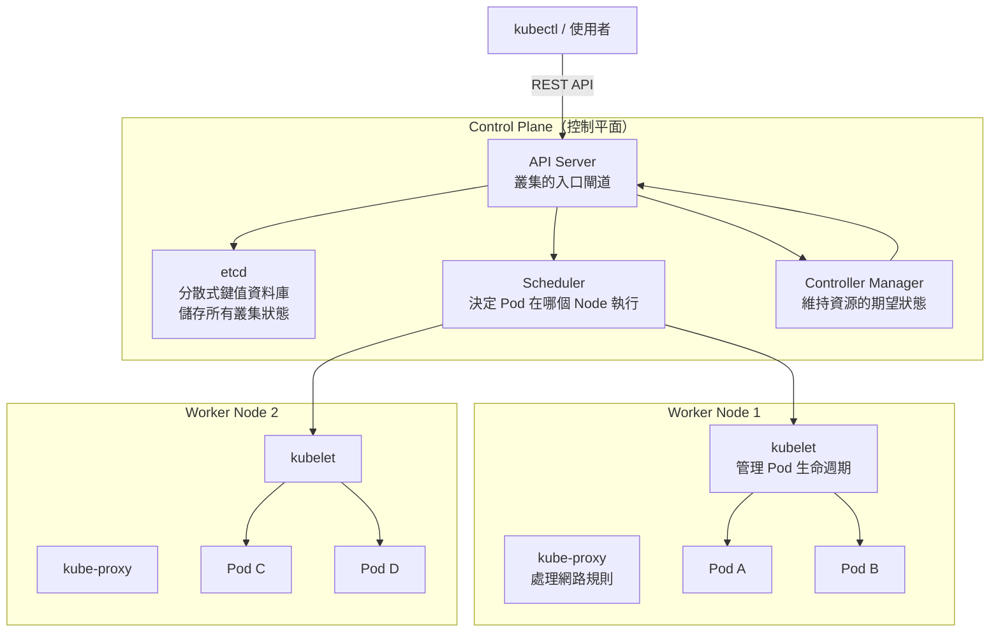

### K8s 核心資源關係

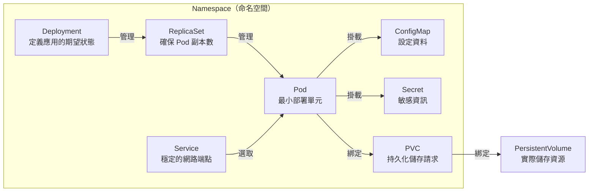

### K8s 資源分類

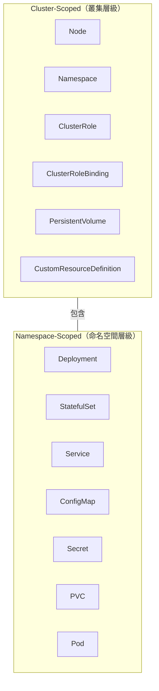

> **初學者筆記**：
> - **Pod** 是 K8s 最小部署單元，通常包含一個容器
> - **Deployment** 管理無狀態應用（如 Web Server）
> - **StatefulSet** 管理有狀態應用（如資料庫）
> - **PVC/PV** 提供持久化儲存，Pod 刪除後資料仍保留
> - **Namespace** 用來隔離不同環境或團隊的資源

---

## 為什麼需要 K8s 備份

### K8s 中需要備份的資料

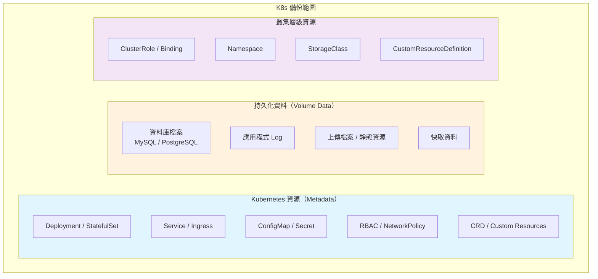

### 常見災難場景

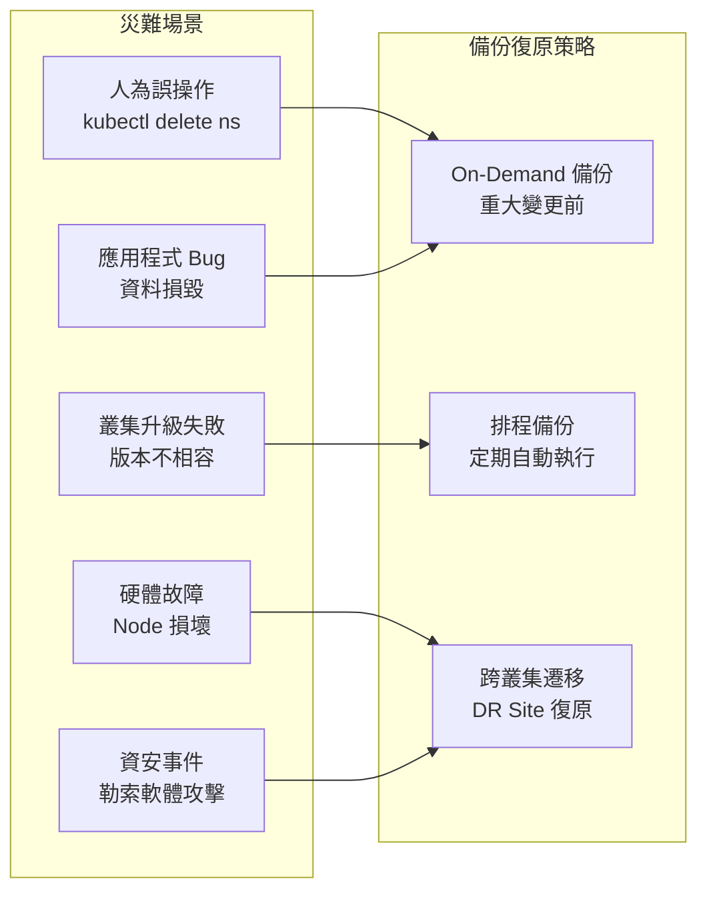

---

## Velero 架構與運作原理

### Velero 元件架構

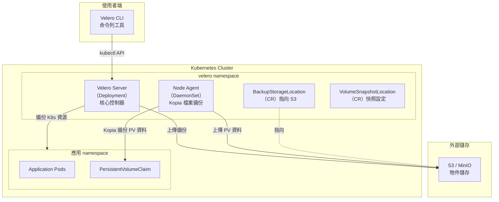

### 備份流程（Backup Workflow）

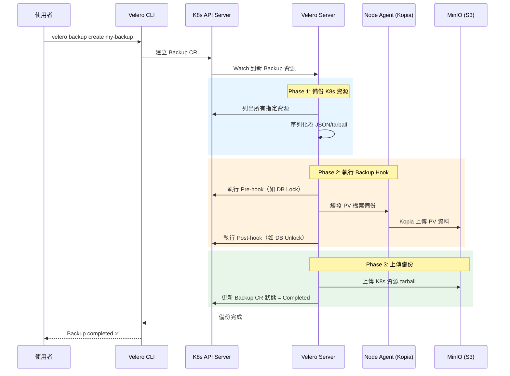

### 復原流程（Restore Workflow）

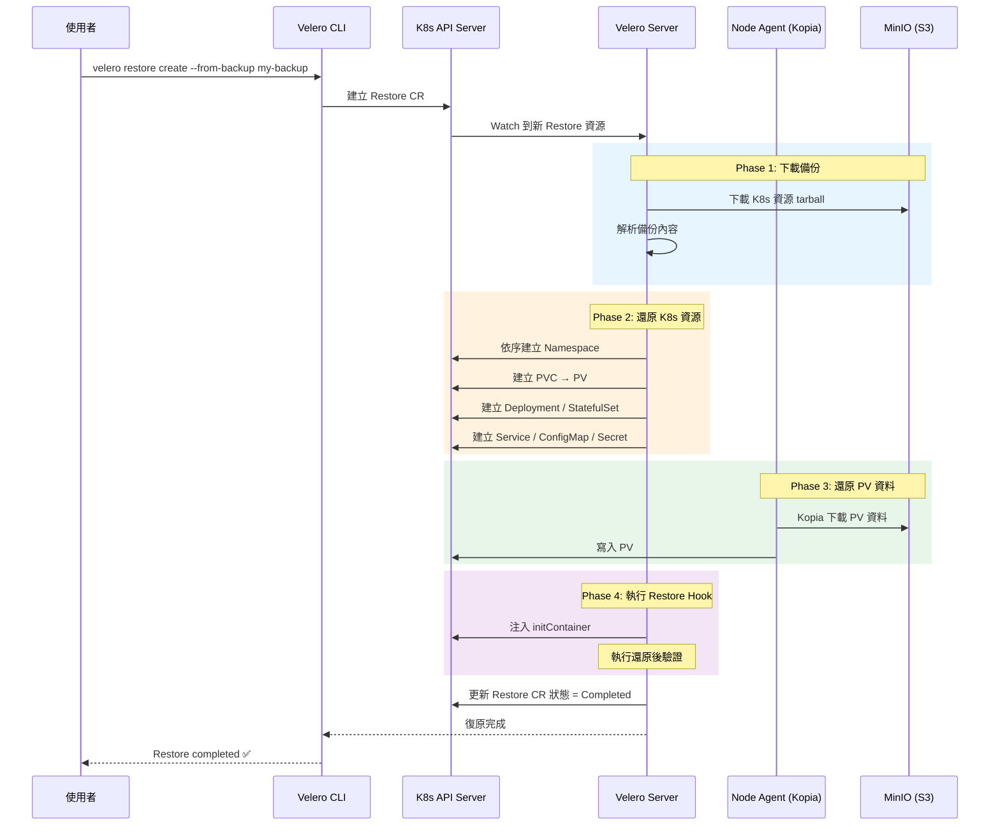

### Velero 備份層級

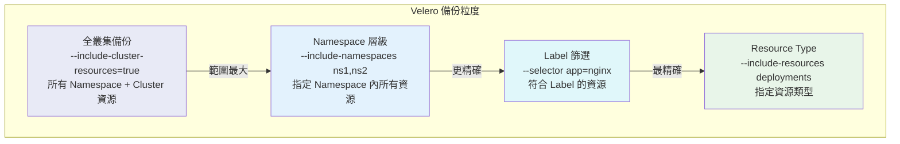

---

## PoC 架構

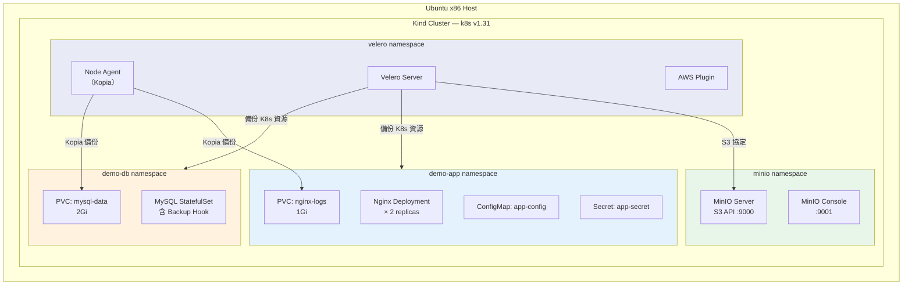

## 技術元件版本

| 元件 | 版本 | 用途 |
|------|------|------|
| Velero | v1.17.0 | K8s 備份復原核心 |
| Velero AWS Plugin | v1.11.0 | S3 相容儲存介面 |
| Kind | v0.24.0 | 本機 K8s 叢集 |
| Kubernetes | v1.31.0 | 容器編排平台 |
| MinIO | latest | S3 相容物件儲存 |
| Kopia | (內建) | 檔案系統層級備份引擎 |
| MySQL | 8.0 | 有狀態示範應用（含 Hook） |
| Nginx | 1.27 | 無狀態示範應用（含 PVC） |

---

## 快速開始

### 前置需求

| 項目 | 最低需求 | 建議配置 |
|------|---------|---------|
| OS | Ubuntu 22.04+ x86_64 | Ubuntu 24.04 LTS |
| CPU | 4 cores | 8 cores |
| RAM | 8 GB | 16 GB |
| Disk | 40 GB | 80 GB SSD |
| Docker | 24.0+ | 27.x |
| kubectl | 1.28+ | 1.30+ |
| Helm | 3.12+ | 3.16+ |

### Step 1 — 安裝工具

```bash
# 安裝 Kind v0.24.0
curl -Lo ./kind https://kind.sigs.k8s.io/dl/v0.24.0/kind-linux-amd64
chmod +x ./kind && sudo mv ./kind /usr/local/bin/

# 安裝 Velero CLI v1.17.0
VELERO_VERSION=v1.17.0
curl -L https://github.com/vmware-tanzu/velero/releases/download/${VELERO_VERSION}/velero-${VELERO_VERSION}-linux-amd64.tar.gz -o velero.tar.gz
tar -xzf velero.tar.gz
sudo mv velero-${VELERO_VERSION}-linux-amd64/velero /usr/local/bin/
rm -rf velero.tar.gz velero-${VELERO_VERSION}-linux-amd64

# 安裝 MinIO Client
curl -LO https://dl.min.io/client/mc/release/linux-amd64/mc
chmod +x mc && sudo mv mc /usr/local/bin/
```

### Step 2 — 建立 Kind 叢集

```bash
kind create cluster --config kind-config.yaml --wait 300s
kubectl cluster-info --context kind-velero-poc
kubectl get nodes
```

### Step 3 — 部署 MinIO

```bash
kubectl apply -f minio-deployment.yaml
kubectl wait --for=condition=ready pod -l app=minio -n minio --timeout=120s

# 建立 Bucket
kubectl port-forward svc/minio -n minio 9000:9000 &
sleep 3
mc alias set myminio http://localhost:9000 minioadmin minioadmin123
mc mb myminio/velero-backup
mc mb myminio/velero-backup-secondary
kill %1
```

### Step 4 — 安裝 Velero

```bash
# 建立憑證檔
cat <<EOF > credentials-velero
[default]
aws_access_key_id=minioadmin
aws_secret_access_key=minioadmin123
EOF

# 安裝 Velero
velero install \
  --provider aws \
  --plugins velero/velero-plugin-for-aws:v1.11.0 \
  --bucket velero-backup \
  --secret-file ./credentials-velero \
  --backup-location-config \
    region=minio,s3ForcePathStyle="true",s3Url=http://minio.minio.svc:9000 \
  --snapshot-location-config region=minio \
  --use-node-agent \
  --uploader-type=kopia \
  --wait

# 驗證安裝
kubectl get pods -n velero
velero backup-location get
# 預期：Phase = Available
```

### Step 5 — 部署示範應用程式

```bash
kubectl apply -f demo-nginx.yaml
kubectl apply -f demo-mysql.yaml

# 等待所有 Pod 就緒
kubectl wait --for=condition=ready pod -l app=nginx -n demo-app --timeout=120s
kubectl wait --for=condition=ready pod -l app=mysql -n demo-db --timeout=180s

# 寫入測試資料
kubectl exec -n demo-app deploy/nginx -- \
  sh -c 'echo "PoC test data - $(date)" > /var/log/nginx/poc-test.log'

kubectl exec -n demo-db sts/mysql -- \
  mysql -u root -prootpass123 -e \
  "USE pocdb; CREATE TABLE IF NOT EXISTS poc_data (id INT AUTO_INCREMENT PRIMARY KEY, msg VARCHAR(255), ts TIMESTAMP DEFAULT CURRENT_TIMESTAMP); INSERT INTO poc_data (msg) VALUES ('Velero PoC initial data');"
```

---

## PoC 測試案例與結果

### 測試結果總覽

| # | 功能 | 測試狀態 |
|---|------|---------|
| 1 | On-Demand 全叢集備份 | Completed |
| 2 | Namespace 層級備份 | Completed |
| 3 | Label Selector 備份 | Completed |
| 4 | Resource Type 篩選備份 | Completed |
| 5 | 排程備份 (Cron) | Completed |
| 6 | Pre/Post Backup Hook (MySQL) | Completed |
| 7 | TTL 過期策略 | Completed |
| 8 | 完整 Disaster Recovery | Completed |
| 9 | 選擇性復原 | Completed |
| 10 | 跨 Namespace 復原 | Completed |
| 11 | Restore Hook | Completed |
| 12 | 多重 Backup Storage Location | Completed |
| 13 | Cluster Resource 備份 | Completed |
| 14 | 叢集遷移模擬 | Completed |

### 測試案例 1 — On-Demand 全叢集備份

備份所有 Namespace（排除系統 Namespace）。

```bash
velero backup create full-backup-01 \
  --exclude-namespaces kube-system,kube-public,kube-node-lease,velero,minio \
  --include-cluster-resources=true \
  --default-volumes-to-fs-backup=true \
  --wait

velero backup describe full-backup-01 --details
```

### 測試案例 2 — Namespace 層級備份

僅備份 `demo-app` namespace。

```bash
velero backup create ns-backup-demo-app \
  --include-namespaces demo-app \
  --default-volumes-to-fs-backup=true \
  --wait
```

### 測試案例 3 — Label Selector 備份

僅備份帶有 `app=nginx` label 的資源。

```bash
velero backup create label-backup-nginx \
  --include-namespaces demo-app \
  --selector app=nginx \
  --wait
```

### 測試案例 4 — Resource Type 篩選備份

僅備份特定資源類型。

```bash
velero backup create resource-backup \
  --include-namespaces demo-app \
  --include-resources deployments,services,configmaps,secrets \
  --wait
```

### 測試案例 5 — 排程備份 (Cron)

```bash
# 每 5 分鐘執行備份（PoC 測試用）
velero schedule create poc-schedule-5min \
  --schedule="*/5 * * * *" \
  --include-namespaces demo-app,demo-db \
  --default-volumes-to-fs-backup=true \
  --ttl 1h0m0s

# 每日凌晨 2 點備份（正式建議）
velero schedule create daily-backup \
  --schedule="0 2 * * *" \
  --include-namespaces demo-app,demo-db \
  --default-volumes-to-fs-backup=true \
  --ttl 168h0m0s

velero schedule get
```

### 測試案例 6 — Pre/Post Backup Hook (MySQL)

MySQL 透過 Pod annotation 設定 Backup Hook，在備份前鎖定資料表、備份後解鎖。

```yaml
# demo-mysql.yaml 中的 annotation 片段
annotations:
  pre.hook.backup.velero.io/command: '["/bin/bash", "-c", "mysql -u root -p$MYSQL_ROOT_PASSWORD -e \"FLUSH TABLES WITH READ LOCK; SELECT SLEEP(5);\""]'
  pre.hook.backup.velero.io/timeout: "30s"
  post.hook.backup.velero.io/command: '["/bin/bash", "-c", "mysql -u root -p$MYSQL_ROOT_PASSWORD -e \"UNLOCK TABLES;\""]'
  post.hook.backup.velero.io/timeout: "10s"
```

```bash
velero backup create db-backup-with-hook \
  --include-namespaces demo-db \
  --default-volumes-to-fs-backup=true \
  --wait
```

Hook 執行流程：

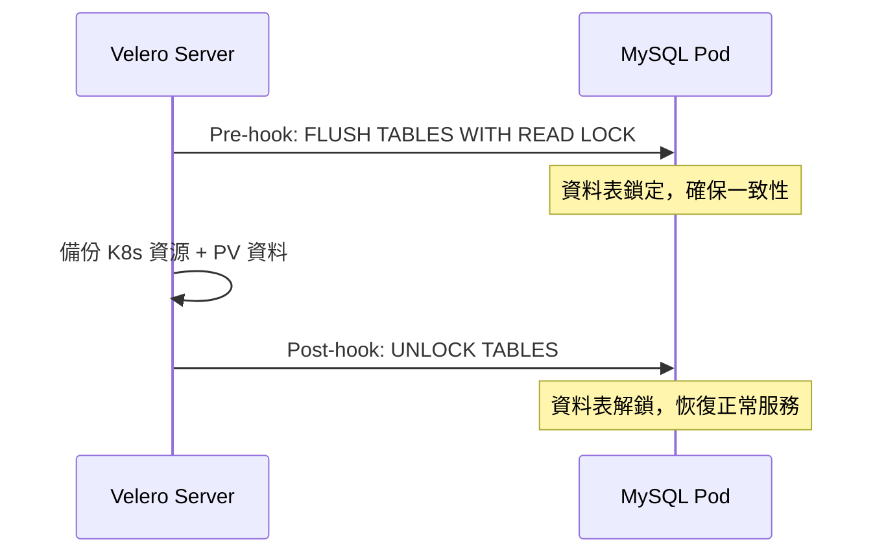

### 測試案例 7 — TTL 過期策略

```bash
velero backup create ttl-test-backup \
  --include-namespaces demo-app \
  --ttl 10m0s \
  --wait

# 確認 TTL
velero backup describe ttl-test-backup | grep -E "TTL|Expiration"
# 10 分鐘後備份會自動被 GC 清理
```

### 測試案例 8 — 完整 Disaster Recovery

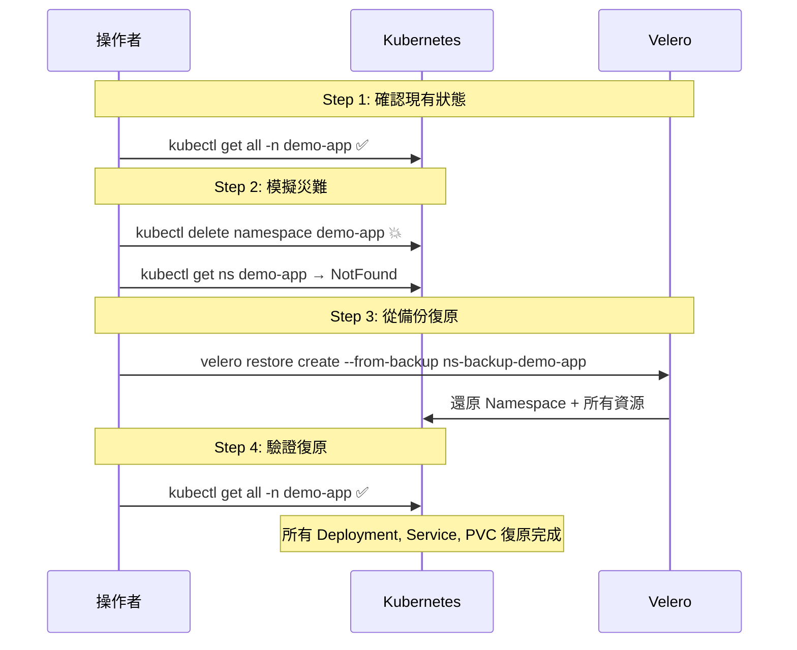

```bash
# 記錄目前狀態
kubectl get all -n demo-app

# 模擬災難 - 刪除 namespace
kubectl delete namespace demo-app

# 確認已刪除
kubectl get ns demo-app  # NotFound

# 從備份復原
velero restore create restore-demo-app \
  --from-backup ns-backup-demo-app \
  --wait

# 驗證復原
kubectl get all -n demo-app
```

### 測試案例 9 — 選擇性復原

僅復原 ConfigMap 和 Secret。

```bash
velero restore create partial-restore \
  --from-backup full-backup-01 \
  --include-namespaces demo-app \
  --include-resources configmaps,secrets \
  --wait
```

### 測試案例 10 — 跨 Namespace 復原

將 `demo-app` 復原到 `demo-app-clone` namespace。

```bash
velero restore create ns-mapping-restore \
  --from-backup ns-backup-demo-app \
  --namespace-mappings demo-app:demo-app-clone \
  --wait

kubectl get all -n demo-app-clone
```

### 測試案例 11 — Restore Hook

透過 Restore CR 注入 initContainer，在還原後執行驗證腳本。

```yaml
# restore-hook-config.yaml
apiVersion: velero.io/v1
kind: Restore
metadata:
  name: restore-with-hook
  namespace: velero
spec:
  backupName: db-backup-with-hook
  includedNamespaces:
    - demo-db
  hooks:
    resources:
      - name: mysql-post-restore
        includedNamespaces: [demo-db]
        labelSelector:
          matchLabels:
            app: mysql
        postHooks:
          - init:
              initContainers:
                - name: post-restore-check
                  image: mysql:8.0
                  command: ["/bin/bash", "-c", "echo 'Post-restore validation completed'"]
```

### 測試案例 12 — 多重 Backup Storage Location

```bash
# 新增第二個 BSL
velero backup-location create secondary \
  --provider aws \
  --bucket velero-backup-secondary \
  --config region=minio,s3ForcePathStyle="true",s3Url=http://minio.minio.svc:9000 \
  --credential cloud-credentials=cloud

# 備份到第二個 BSL
velero backup create secondary-bsl-backup \
  --include-namespaces demo-app \
  --storage-location secondary \
  --wait

velero backup-location get
```

### 測試案例 13 — Cluster Resource 備份

```bash
velero backup create cluster-resources-backup \
  --include-cluster-resources=true \
  --include-resources clusterroles,clusterrolebindings,customresourcedefinitions \
  --wait
```

### 測試案例 14 — 叢集遷移模擬

透過 Namespace Mapping 模擬跨叢集遷移。

```bash
# 建立遷移備份
velero backup create migration-backup \
  --include-namespaces demo-app,demo-db \
  --include-cluster-resources=true \
  --default-volumes-to-fs-backup=true \
  --wait

# 模擬遷移到新環境（透過 Namespace Mapping）
velero restore create migration-restore \
  --from-backup migration-backup \
  --namespace-mappings demo-app:migrated-app,demo-db:migrated-db \
  --wait

kubectl get all -n migrated-app
kubectl get all -n migrated-db
```

---

## 備份與復原策略指南

### RPO / RTO 概念

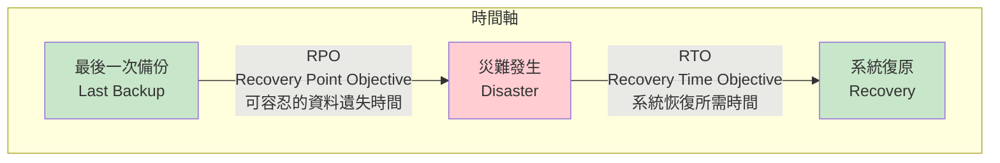

| 指標 | 說明 | 本 PoC 驗證結果 |
|------|------|----------------|
| **RPO** | 從災難發生到最後一次備份的時間差 | Schedule 每 5 分鐘 → RPO < 5 min |
| **RTO** | 從災難發生到服務恢復的時間 | Restore 約 5~30 秒 → RTO < 1 min |

### 建議的備份策略

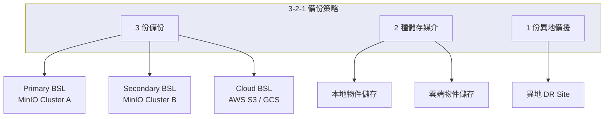

---

## 專案檔案說明

| 檔案 | 說明 |
|------|------|
| `kind-config.yaml` | Kind 叢集配置（1 control-plane + 2 worker） |
| `minio-deployment.yaml` | MinIO S3 相容儲存部署清單 |
| `demo-nginx.yaml` | Nginx + PVC + ConfigMap + Secret 示範應用 |
| `demo-mysql.yaml` | MySQL StatefulSet 含 Velero Backup Hook |
| `restore-hook-config.yaml` | Restore Hook 設定範例（initContainer 注入） |
| `velero-poc-kind-ubuntu.md` | 完整 PoC 規劃文件與操作步驟 |

---

## 常用指令參考

### 備份操作

```bash
# 查看所有備份
velero backup get

# 建立備份
velero backup create <name> --include-namespaces <ns> --wait

# 查看備份詳情
velero backup describe <name> --details

# 查看備份 log
velero backup logs <name>
```

### 復原操作

```bash
# 從備份復原
velero restore create <name> --from-backup <backup-name> --wait

# 跨 namespace 復原
velero restore create <name> --from-backup <backup> --namespace-mappings old-ns:new-ns --wait

# 查看復原狀態
velero restore get
velero restore describe <name>
```

### 排程管理

```bash
# 建立排程
velero schedule create <name> --schedule="0 2 * * *" --ttl 168h0m0s

# 查看排程
velero schedule get

# 刪除排程
velero schedule delete <name> --confirm
```

### 除錯

```bash
# Velero Server Log
kubectl logs deployment/velero -n velero -f

# Node Agent (Kopia) Log
kubectl logs daemonset/node-agent -n velero -f

# BSL 狀態
velero backup-location get
```

---

## 常見問題排查

| 問題 | 排查方式 | 解決方案 |
|------|---------|---------|
| BSL 顯示 Unavailable | `velero backup-location get` | 檢查 MinIO 連線與憑證是否正確 |
| Backup 狀態 PartiallyFailed | `velero backup logs <name>` | 查看哪些資源備份失敗 |
| PV 資料未備份 | `velero backup describe <name>` | 確認使用 `--default-volumes-to-fs-backup` |
| Restore 資源衝突 | `velero restore logs <name>` | 加上 `--existing-resource-policy=update` |
| Hook 執行逾時 | `velero backup logs <name> \| grep hook` | 調整 Pod annotation 中的 timeout 值 |
| CLI 無法取得 log | CLI 連不到叢集內 MinIO | 使用 `kubectl logs deployment/velero -n velero` 替代 |
| Schedule 沒觸發 | `velero schedule get` 確認 Status | 檢查 Cron 表達式是否正確 |

---

## 企業評估摘要

### Velero vs 其他備份方案

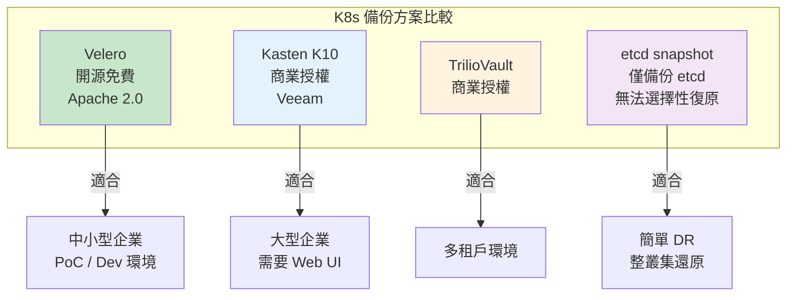

### 優勢

- 完全開源免費（Apache 2.0 授權），無節點數限制
- 透過 Kubernetes API 備份（非直接存取 etcd），安全性更高
- 支援 Kopia/Restic 檔案系統備份，不依賴 CSI Snapshot
- Plugin 架構可擴充，支援 AWS / Azure / GCP 等主流雲端
- 社群活躍，VMware/Broadcom 持續維護

### 限制

- 純 CLI 操作，無內建 Web UI（可搭配第三方 Dashboard）
- 應用層一致性備份需自行實作 Hook
- RBAC 與多租戶管理需額外配置
- 加密依賴儲存端（MinIO SSE）或 Kopia 內建加密

### 金融業合規建議

- 搭配 MinIO + TLS + Server-Side Encryption 滿足資料加密需求
- 搭配 PostgreSQL WAL Archiving 或 MySQL binlog 做資料庫層級備份
- 透過 CronJob + Velero Schedule 實現 RPO < 1hr
- 建議 BSL 設定 Immutable Bucket 防止勒索軟體竄改

---

## 清理環境

```bash
# 刪除排程與備份
velero schedule delete --all --confirm
velero backup delete --all --confirm

# 刪除 Kind 叢集
kind delete cluster --name velero-poc

# 清理本機檔案
rm -f credentials-velero
```

---

## 延伸學習資源

- [Velero 官方文件](https://velero.io/docs/)
- [Kubernetes 官方文件](https://kubernetes.io/docs/home/)
- [MinIO 官方文件](https://min.io/docs/minio/linux/index.html)
- [Kind 官方文件](https://kind.sigs.k8s.io/)

---

> **PoC 完成日期**：2026-02-10
> **環境**：Ubuntu x86 / Kind v0.24.0 / Velero v1.17.0
> **測試結果**：14/14 測試案例全數通過 Completed
